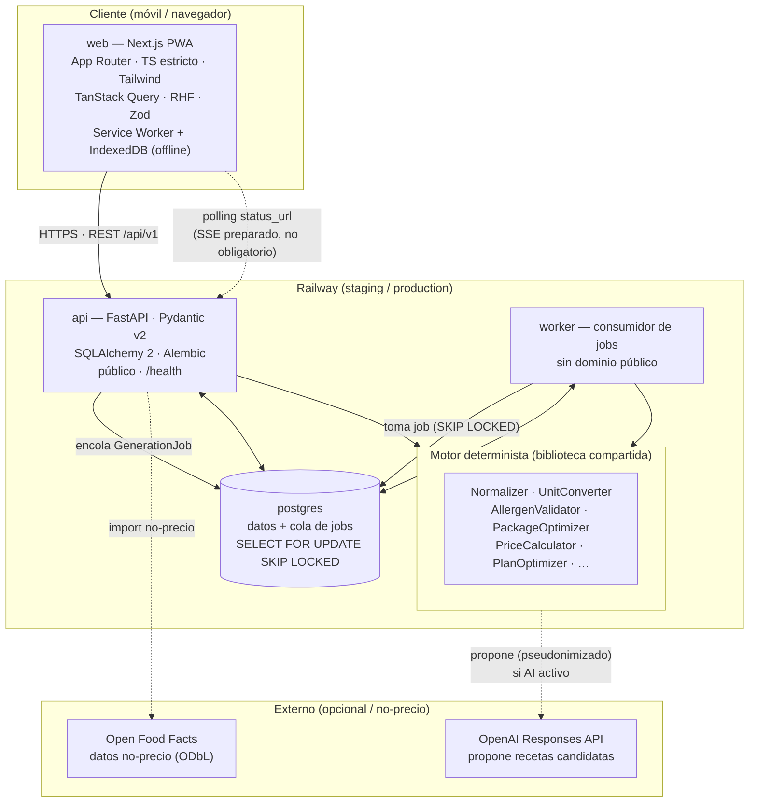
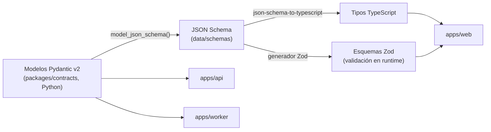
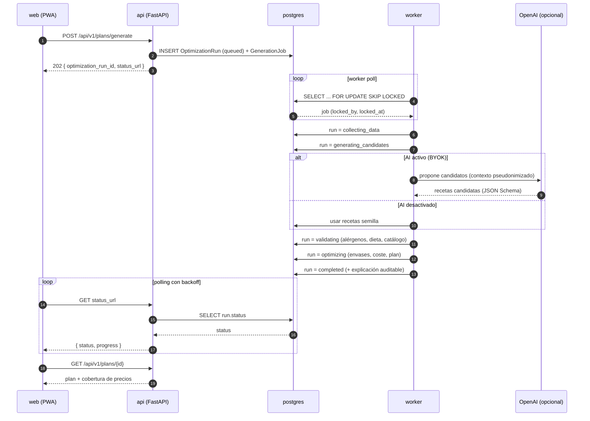
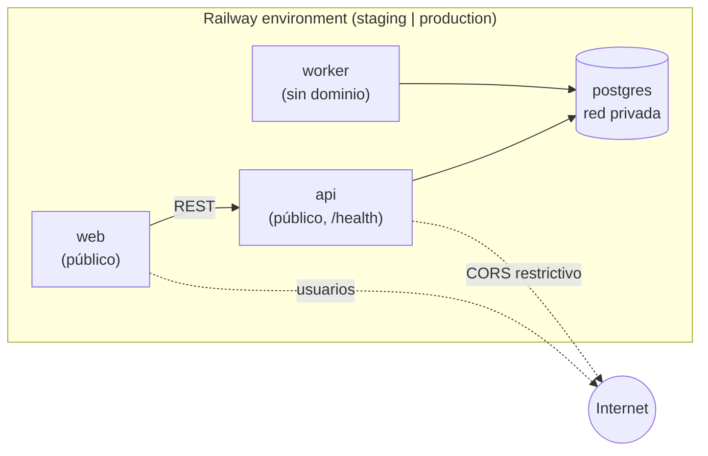

# CestaPlan — ARQUITECTURA

> Arquitectura técnica del MVP. Consistente con el fichero canónico de decisiones y con `docs/PRD.md`.
> Prosa en español; identificadores y claves en inglés.

---

## 1. Visión general

CestaPlan es un monorepo con tres aplicaciones desplegables (`web`, `api`, `worker`), un Postgres compartido y un
paquete de contratos que garantiza tipos coherentes entre Python y TypeScript. La regla arquitectónica central es
una **frontera dura**:

> **OpenAI propone. El núcleo determinista valida y calcula.**

OpenAI es **opcional** y sustituible por recetas semilla. Ninguna decisión crítica (seguridad de alergia, precio,
coste, envases, disponibilidad, conversión de unidades) depende de él.

### 1.1 Diagrama de componentes



---

## 2. Frontera dura: OpenAI propone / motor determinista valida y calcula

| Puede hacer OpenAI | **No** puede decidir OpenAI (lo decide el motor) |
|---|---|
| Proponer recetas candidatas (esquema estructurado) | Seguridad de **alergia** |
| Redactar instrucciones / pasos | **Precio** y **coste total** |
| Clasificar estilos, sugerir sustituciones | **Nº de envases** y disponibilidad |
| Explicar la elección, crear variaciones | Calorías/macros **definitivos** |
| Normalizar texto libre (sujeto a validación) | Cumplimiento de **presupuesto** |
| Proponer título/descripción | **Conversión de unidades**, tienda de un precio |

Consecuencia de diseño: la salida de OpenAI **siempre** entra al motor como *candidato no confiable* y sale como
*plan validado y calculado*. Nada de la IA se persiste como verdad económica o de seguridad sin pasar por el motor.

El **flujo obligatorio de 12 pasos** materializa esta frontera:

```mermaid
flowchart LR
    S1["1 · motor selecciona<br/>restricciones/contexto"] --> S2["2 · OpenAI devuelve<br/>candidatos estructurados"]
    S2 --> S3["3 · validar JSON"] --> S4["4 · normalizar<br/>ingredientes"]
    S4 --> S5["5 · comparar con<br/>catálogo permitido"] --> S6["6 · validar<br/>restricciones duras"]
    S6 --> S7["7 · calcular<br/>nutrientes"] --> S8["8 · calcular<br/>envases"]
    S8 --> S9["9 · calcular<br/>coste"] --> S10["10 · rechazar<br/>incompatibles"]
    S10 --> S11["11 · optimizador elige<br/>mejor combinación"] --> S12["12 · almacenar<br/>explicación auditable"]
```



Los pasos 3–12 son **deterministas**. Solo el paso 2 involucra a OpenAI, y es opcional (recetas semilla lo sustituyen).

---

## 3. Estructura del monorepo (sección 14)

```text
/root/cestaplan
├── apps
│   ├── web          # Next.js (App Router) PWA — público
│   ├── api          # FastAPI — público, /health, pre-deploy: alembic upgrade head
│   └── worker       # consumidor de GenerationJob — sin dominio
├── packages
│   ├── contracts    # Pydantic v2 → JSON Schema → tipos TS + Zod (fuente única)
│   ├── ui           # componentes React compartidos
│   └── config       # config compartida (tsconfig, eslint, tailwind, prettier)
├── data
│   ├── demo         # supermercado sintético (is_synthetic=true)
│   ├── imports      # CSV/JSON de importación (admin_import)
│   └── schemas      # JSON Schema publicados desde contracts
├── docs
│   ├── PRD.md  ARCHITECTURE.md  DATA_MODEL.md  DATA_SOURCES.md
│   ├── OPTIMIZATION.md  OPENAI.md  SECURITY.md  PRIVACY.md
│   ├── DEPLOYMENT.md  CONTRIBUTING.md  ADAPTER_GUIDE.md  ROADMAP.md
│   └── adr/         # Architecture Decision Records
├── infra
│   └── railway      # definición de servicios Railway
├── scripts          # utilidades (seed, export de schemas, etc.)
├── docker-compose.yml
├── Makefile
├── README.md
├── LICENSE          # MIT (código)
└── .env.example
```

Herramientas: **pnpm workspaces + Turborepo** (JS), **uv + Python 3.12** (backend).

---

## 4. Paquete de contratos (fuente única de tipos)

Para evitar divergencia entre backend y frontend, los modelos se definen **una vez** en Pydantic v2 y se derivan
hacia TypeScript y Zod.



- **Autoridad**: los modelos Pydantic. El JSON Schema es un artefacto generado, versionado en `data/schemas`.
- **Frontend**: consume los **tipos TS** (compilación) y los **esquemas Zod** (validación en runtime de respuestas
  de la API y de formularios con React Hook Form).
- **Dinero**: en los contratos, los importes monetarios son **string** en el lado JS (nunca `number`) y `Decimal`
  en Pydantic/SQLAlchemy.

---

## 5. Flujo de generación asíncrona

La generación de un plan puede tardar (llamada a OpenAI + optimización), por lo que es **asíncrona** mediante un job
persistido en Postgres. La cola usa `SELECT FOR UPDATE SKIP LOCKED` — sin Redis.

### 5.1 Contrato HTTP

| Paso | Request | Response |
|---|---|---|
| Encolar | `POST /api/v1/plans/generate` | `202 Accepted` + `{ optimization_run_id, status_url }` |
| Consultar | `GET {status_url}` | `{ status, progress?, result_url? }` |
| Resultado | `GET /api/v1/plans/{id}` | Plan completo cuando `status == completed` |

Estados del run: `queued`, `collecting_data`, `generating_candidates`, `validating`, `optimizing`, `completed`,
`failed`, `cancelled`.

### 5.2 Campos del job (`GenerationJob`)

`SELECT FOR UPDATE SKIP LOCKED`, más: `attempts`, `last_error`, `locked_at`, `locked_by`, `heartbeat`, reintentos
limitados con backoff.

### 5.3 Diagrama de secuencia



### 5.4 Polling y SSE

- El frontend hace **polling con backoff** sobre `status_url` (TanStack Query con intervalos crecientes).
- **SSE está preparado pero no es obligatorio** en el MVP: la API puede exponer un endpoint de stream de estado más
  adelante sin cambiar el contrato de `POST /generate`.
- El **heartbeat** del worker permite detectar jobs colgados y reintentarlos dentro del límite de `attempts`.

---

## 6. Modelo de servicios Railway

| Servicio | Root | Público | Notas |
|---|---|---|---|
| **web** | `apps/web` | Sí (dominio) | Next.js PWA |
| **api** | `apps/api` | Sí (dominio) | Pre-deploy: `alembic upgrade head`; health check en `/health` |
| **worker** | `apps/worker` | **No** (sin dominio) | Consume `GenerationJob` vía red privada |
| **postgres** | — | No | `DATABASE_URL` compartida por red privada |

Entornos: **staging** y **production**. Config por variables de entorno (ver `.env.example`): `DEPLOYMENT_MODE`
(`self_hosted`/`cloud`), `AI_BILLING_MODE` (`platform`/`byok`/`disabled`), credenciales OpenAI, parámetros del worker.



---

## 7. Decisiones tecnológicas y justificación

| Decisión | Alternativa descartada | Justificación |
|---|---|---|
| **Cola en Postgres** (`SKIP LOCKED`) | Redis / Celery / RabbitMQ | Un componente menos que operar; suficiente para la carga del MVP; transaccional junto al resto de datos |
| **FastAPI + Pydantic v2** | Django / Flask | Tipos estrictos, JSON Schema nativo (base de los contratos), async |
| **SQLAlchemy 2 + Alembic** | ORM ligero / SQL crudo | Migraciones versionadas, historial de precios sin `UPDATE` destructivo |
| **Contratos Pydantic → TS + Zod** | Tipos duplicados a mano | Fuente única, evita divergencia backend/frontend |
| **Next.js App Router + PWA** | App nativa | Mobile-first, offline con Service Worker + IndexedDB, un solo código |
| **Dinero `Decimal`/`numeric`/string** | `float` | Exactitud monetaria; el `float` introduce error de redondeo inaceptable |
| **Monorepo pnpm + Turborepo + uv** | Multirepo | Contratos compartidos, builds cacheados, versión única |
| **Sesiones opacas en BD** | JWT en `localStorage` | Revocables, sin secreto de larga vida expuesto en el cliente |
| **Motor determinista como biblioteca** | Lógica dentro de la ruta HTTP | Reutilizable por `api` y `worker`, testeable, reproducible |
| **OpenAI Responses API + JSON Schema** | Prompting libre | Salida estructurada validable; modelo configurable por env |
| **Docker + compose + GitHub Actions + Railway** | K8s | Complejidad proporcional al MVP; despliegue simple |

---

## 8. Motor determinista

Biblioteca Python independiente de OpenAI, compartida por `api` y `worker`. Componentes:

`IngredientNormalizer`, `UnitConverter`, `AllergenValidator`, `DietaryRestrictionValidator`, `PantryCalculator`,
`ProductMatcher`, `PackageOptimizer`, `NutritionCalculator`, `PriceCalculator`, `MealScheduler`, `PlanOptimizer`,
`ConstraintExplainer`.

Estrategia inicial: filtrado de **restricciones duras** primero, luego **greedy + backtracking limitado** con
**semilla reproducible**, función de puntuación configurable (penalizaciones: desperdicio, repetición, coste, tiempo,
desviación nutricional; bonificaciones: despensa, favoritos; penalización fuerte a platos rechazados) y selección de
**envases** por búsqueda discreta con reutilización de ingredientes.

**Sin solución**: no se devuelve una solución falsa. Se devuelve el **conjunto mínimo de restricciones conflictivas**,
el presupuesto mínimo hallado, los productos que provocan el exceso y las restricciones blandas relajables
(subir presupuesto / reducir comidas / cambiar de tienda / aceptar estimados). Lo produce `ConstraintExplainer`.

---

## 9. Preparado pero no implementado

| Elemento | Estado | Nota |
|---|---|---|
| **OR-Tools** | Interfaz preparada, **no** introducida | `PlanOptimizer` expone una frontera para un solver CP-SAT futuro sin cambiar su firma pública |
| **SSE** | Preparado, no obligatorio | El contrato `POST /generate` no cambia al añadirlo; el MVP usa polling con backoff |
| **Redis** | No usado en MVP | La cola vive en Postgres; introducirlo sería una optimización posterior |
| **Adaptadores de cadenas** | Solo esqueletos | Aldi, Lidl, Carrefour, Dia, Alcampo, Deza; `MercadonaCommunityAdapter` experimental **desactivado** |
| **Pagos** | Fuera de alcance | `UsageLedger` registra consumo IA en modo `cloud`, sin cobro |
| **OCR de tickets** | `source_type=user_receipt` reservado | Sin flujo pulido en el MVP |

Adaptadores activos en el MVP (contrato único `RetailerAdapter`): `DemoRetailerAdapter`, `CsvRetailerAdapter`,
`JsonRetailerAdapter`, `ManualRetailerAdapter`, `OpenFoodFactsAdapter` (solo datos **no-precio**, respetando ODbL).

---

## 10. Invariantes transversales

- **UUID público + PK interna** en cada entidad; fechas en **UTC**.
- **Dinero**: `Decimal`/`numeric` en backend, **string** en el borde JS.
- **Historial de precios**: insertar filas nuevas, nunca `UPDATE` destructivo.
- **Recetas versionadas** (`Recipe` + `RecipeVersion`).
- **Pseudonimización** antes de cualquier llamada a OpenAI.
- **Seguridad**: CORS restrictivo, cabeceras de seguridad, CSRF en mutaciones, rate limiting en login, `AuditLog`.
- **Reproducibilidad**: semilla fija ⇒ mismo plan; explicación auditable persistida (`OptimizationRun`,
  `OptimizationCandidate`, `OptimizationConstraint`).
