# CestaPlan — Modelo de datos

Este documento describe el modelo de datos completo de CestaPlan: entidades, campos,
relaciones, invariantes e índices. Es coherente con las decisiones canónicas del proyecto
y con `docs/ARCHITECTURE.md`, `docs/DATA_SOURCES.md` y `docs/ADAPTER_GUIDE.md`.

Backend: **PostgreSQL + SQLAlchemy 2 + Alembic**. La prosa está en español; los nombres de
tablas, columnas y tipos permanecen en inglés (identificadores de código).

---

## 1. Convenciones globales (invariantes)

Estas reglas se aplican a **todas** las tablas salvo que se indique lo contrario:

- **Identidad doble: PK interna `bigint` + UUID público.**
  Cada tabla tiene `id bigserial PRIMARY KEY` (clave interna, nunca expuesta en la API ni en
  URLs) y `public_id uuid NOT NULL UNIQUE DEFAULT gen_random_uuid()` (identificador estable
  hacia el exterior). Las claves foráneas usan la PK interna `bigint` por eficiencia; la API
  traduce a/desde `public_id`. Esto evita filtrar cardinalidades y enumerabilidad de recursos.
- **Fechas en UTC.** Todas las columnas temporales son `timestamptz` y se almacenan en UTC.
  La conversión a la zona del usuario ocurre en la capa de presentación. Nunca se usa
  `timestamp` sin zona.
- **Dinero como `numeric`, jamás `float`.** Todos los importes monetarios usan
  `numeric(12, 4)` en Postgres y `Decimal` en Python. En la frontera JS/JSON el dinero viaja
  como **string**. Las cantidades físicas (gramos, litros) también usan `numeric` para evitar
  errores de redondeo binario.
- **Auditoría temporal mínima.** Toda tabla incluye `created_at timestamptz NOT NULL DEFAULT
  now()` y `updated_at timestamptz NOT NULL DEFAULT now()` (actualizada por la aplicación o
  por trigger). No se listan en cada tabla de abajo para no repetir; se asumen presentes.
- **Historial de precios por inserción, no `UPDATE` destructivo.** `ProductPrice` es
  *append-only*: una nueva observación de precio es una fila nueva. Nunca se sobrescribe un
  precio anterior. El precio "actual" es la última observación válida no caducada.
- **Recetas versionadas.** El contenido editable de una receta vive en `RecipeVersion`;
  `Recipe` es la identidad estable. Los planes referencian una versión concreta para ser
  reproducibles y auditables.
- **Soft delete sólo donde hace falta.** Se usa `deleted_at timestamptz NULL` únicamente en
  entidades donde el borrado lógico aporta valor operativo (recetas, ítems de despensa,
  productos retirados de catálogo, listas). El resto se borra físicamente.
- **Datos personales: borrado real / anonimización.** El borrado de cuenta implica supresión
  física o anonimización irreversible de datos personales (ver `docs/PRIVACY.md`). No se hace
  soft delete de datos personales: se eliminan o se pseudonimizan de forma efectiva.
- **Enumeraciones** como `text` con `CHECK` (o tipos ENUM nativos donde el conjunto es
  estable), documentadas junto a cada campo.
- **Integridad referencial** con claves foráneas explícitas y `ON DELETE` acorde a la
  semántica de cada relación (cascada en dependencias de propiedad, restricción en catálogos).

---

## 2. Diagrama entidad-relación (ERD)

Diagrama de las entidades de la sección 16 y sus relaciones principales. Por legibilidad se
muestran las relaciones estructurales dominantes; algunas FK opcionales de auditoría se omiten.

```mermaid
erDiagram
    User ||--o{ UserSession : "abre"
    User ||--o{ HouseholdMember : "es"
    User ||--o{ FavoriteRecipe : "marca"
    User ||--o{ AuditLog : "genera"

    Household ||--o{ HouseholdMember : "agrupa"
    Household ||--o{ HouseholdInvitation : "invita"
    Household ||--o{ DietaryProfile : "define"
    Household ||--o{ Equipment : "posee"
    Household ||--o{ PantryItem : "almacena"
    Household ||--o{ MealPlan : "planifica"
    Household ||--o{ GroceryList : "produce"
    Household ||--o{ UsageLedger : "consume"

    HouseholdMember ||--o{ DietaryProfile : "titular"
    DietaryProfile ||--o{ Allergy : "declara"
    DietaryProfile ||--o{ DietaryRestriction : "impone"
    DietaryProfile ||--o{ FoodPreference : "expresa"

    Retailer ||--o{ Store : "opera"
    Retailer ||--o{ ProductPrice : "fija"
    Store ||--o{ ProductPrice : "ofrece"
    Store ||--o{ ProductAvailability : "informa"

    DataSource ||--o{ DataImport : "origina"
    DataSource ||--o{ ProductPrice : "respalda"
    DataImport ||--o{ ProductPrice : "carga"
    DataImport ||--o{ Product : "carga"

    ProductCategory ||--o{ Product : "clasifica"
    Product ||--o{ ProductVariant : "tiene"
    Product ||--o{ ProductBarcode : "identifica"
    Product ||--o{ ProductPrice : "cotiza"
    Product ||--o{ ProductAvailability : "cubre"
    Product ||--o| ProductNutrition : "nutre"
    Product ||--o{ IngredientProductMapping : "mapea"

    Ingredient ||--o{ IngredientAlias : "alias"
    Ingredient ||--o{ IngredientConversion : "convierte"
    Ingredient ||--o{ IngredientProductMapping : "resuelve"
    Ingredient ||--o{ RecipeIngredient : "usa"
    Ingredient ||--o{ PantryItem : "guarda"

    Recipe ||--o{ RecipeVersion : "versiona"
    Recipe ||--o{ RecipeFeedback : "recibe"
    Recipe ||--o{ FavoriteRecipe : "favorita"
    RecipeVersion ||--o{ RecipeStep : "detalla"
    RecipeVersion ||--o{ RecipeIngredient : "requiere"
    RecipeVersion ||--o{ RecipeTag : "etiqueta"
    RecipeVersion ||--o{ PlannedMeal : "instancia"

    MealPlan ||--o{ MealRequirement : "especifica"
    MealPlan ||--o{ PlannedMeal : "contiene"
    MealPlan ||--o| GroceryList : "genera"
    MealPlan ||--o{ OptimizationRun : "optimiza"
    MealRequirement ||--o{ PlannedMeal : "satisface"

    GroceryList ||--o{ GroceryListItem : "agrupa"
    GroceryListItem ||--o| Product : "referencia"
    GroceryListItem ||--o{ ProductSubstitution : "sustituye"

    OptimizationRun ||--o{ OptimizationCandidate : "evalua"
    OptimizationRun ||--o{ OptimizationConstraint : "restringe"
    OptimizationRun ||--o| GenerationJob : "ejecuta"
    OptimizationCandidate ||--o| RecipeVersion : "propone"
```

---

## 3. Tablas por entidad

Notación de columnas:

- **Tipo**: tipo Postgres. `bigint` = PK/FK interna; `uuid` = identificador público.
- **Nula**: `NO` = `NOT NULL`; `SÍ` = admite `NULL`.
- Se omiten `id`, `public_id`, `created_at`, `updated_at` en cada tabla (ver §1), salvo cuando
  un campo temporal tiene semántica propia.
- El icono **[VS]** marca las entidades que forman parte del **vertical slice** (FASE 3).

---

### 3.1 Identidad y hogar

#### User **[VS]**
Cuenta de persona. Contiene datos personales sujetos a minimización y borrado.

| Campo | Tipo | Nula | Notas |
|---|---|---|---|
| `email` | citext | NO | Único (índice único). Dato personal. |
| `email_verified_at` | timestamptz | SÍ | Momento de verificación del correo. |
| `password_hash` | text | NO | **Argon2id**. Nunca se registra ni se expone. |
| `display_name` | text | SÍ | Nombre visible. Dato personal, pseudonimizable. |
| `locale` | text | NO | Idioma/formato (por defecto `es-ES`). |
| `ai_consent_at` | timestamptz | SÍ | Consentimiento explícito para envío de contexto a OpenAI. `NULL` = sin consentimiento. |
| `status` | text | NO | `active`, `suspended`, `anonymized`. |
| `last_login_at` | timestamptz | SÍ | Última autenticación correcta. |

Borrado de cuenta: `status='anonymized'` con supresión de `email`, `display_name` y
`password_hash`, o borrado físico según elección del usuario. No hay soft delete que preserve
datos personales.

#### UserSession **[VS]**
Sesión **opaca** persistida en BD (no JWT de larga vida). Cookie `HttpOnly`, `Secure` en
producción, `SameSite` apropiado.

| Campo | Tipo | Nula | Notas |
|---|---|---|---|
| `user_id` | bigint | NO | FK → `User`. `ON DELETE CASCADE`. |
| `token_hash` | bytea | NO | **Hash** del token de sesión (no se guarda el token en claro). Índice único. |
| `issued_at` | timestamptz | NO | Emisión. |
| `expires_at` | timestamptz | NO | Expiración absoluta. |
| `revoked_at` | timestamptz | SÍ | Revocación explícita (logout, seguridad). `NULL` = activa. |
| `last_seen_at` | timestamptz | SÍ | Última actividad observada. |
| `ip_hash` | bytea | SÍ | Hash de IP para detección de abuso (dato mínimo). |
| `user_agent` | text | SÍ | Cadena de agente, truncada. |

Sesión válida = `revoked_at IS NULL AND expires_at > now()`.

#### Household **[VS]**
Unidad de convivencia. Ámbito de permisos y de toda la planificación.

| Campo | Tipo | Nula | Notas |
|---|---|---|---|
| `name` | text | NO | Nombre del hogar. |
| `owner_user_id` | bigint | NO | FK → `User`. Propietario inicial. |
| `default_retailer_id` | bigint | SÍ | FK → `Retailer`. Tienda preferida por defecto. |
| `default_store_id` | bigint | SÍ | FK → `Store`. |
| `currency` | text | NO | ISO 4217, por defecto `EUR`. |
| `deleted_at` | timestamptz | SÍ | Soft delete del hogar. |

#### HouseholdMember **[VS]**
Pertenencia de un `User` a un `Household` con rol. También modela comensales (una persona del
hogar puede no ser usuaria del sistema pero sí contar como comensal).

| Campo | Tipo | Nula | Notas |
|---|---|---|---|
| `household_id` | bigint | NO | FK → `Household`. `ON DELETE CASCADE`. |
| `user_id` | bigint | SÍ | FK → `User`. `NULL` si es comensal no-usuario. |
| `role` | text | NO | `owner`, `editor`, `viewer`. Gobierna permisos. |
| `display_name` | text | SÍ | Nombre del comensal (dato personal). |
| `is_eater` | boolean | NO | Si cuenta como comensal para raciones. Por defecto `true`. |
| `joined_at` | timestamptz | NO | Alta en el hogar. |

Restricción única `(household_id, user_id)` cuando `user_id IS NOT NULL`.

#### HouseholdInvitation
Invitación pendiente a unirse a un hogar.

| Campo | Tipo | Nula | Notas |
|---|---|---|---|
| `household_id` | bigint | NO | FK → `Household`. `ON DELETE CASCADE`. |
| `email` | citext | NO | Destinatario. Dato personal. |
| `role` | text | NO | Rol propuesto (`editor`, `viewer`). |
| `token_hash` | bytea | NO | Hash del token de invitación. |
| `invited_by_user_id` | bigint | NO | FK → `User`. |
| `expires_at` | timestamptz | NO | Caducidad de la invitación. |
| `accepted_at` | timestamptz | SÍ | Aceptación. `NULL` = pendiente. |

---

### 3.2 Perfil dietético y seguridad alimentaria

#### DietaryProfile **[VS]**
Perfil dietético asociado a un miembro del hogar (o al hogar en conjunto). Datos **sensibles**.

| Campo | Tipo | Nula | Notas |
|---|---|---|---|
| `household_id` | bigint | NO | FK → `Household`. `ON DELETE CASCADE`. |
| `household_member_id` | bigint | SÍ | FK → `HouseholdMember`. `NULL` = perfil de hogar. |
| `diet_type` | text | SÍ | `omnivore`, `vegetarian`, `vegan`, `pescatarian`, … |
| `energy_target_kcal` | numeric(7,2) | SÍ | Objetivo calórico diario orientativo. |
| `protein_target_g` | numeric(7,2) | SÍ | Objetivo de proteína. |
| `carb_target_g` | numeric(7,2) | SÍ | Objetivo de carbohidratos. |
| `fat_target_g` | numeric(7,2) | SÍ | Objetivo de grasa. |
| `notes` | text | SÍ | Notas libres (no clínicas). |

No es consejo médico (disclaimer obligatorio). Se envía a OpenAI sólo pseudonimizado y con
consentimiento.

#### Allergy **[VS]**
Alérgeno declarado. **Restricción DURA**: la validación es determinista, nunca la decide el LLM.

| Campo | Tipo | Nula | Notas |
|---|---|---|---|
| `dietary_profile_id` | bigint | NO | FK → `DietaryProfile`. `ON DELETE CASCADE`. |
| `allergen_code` | text | NO | Código canónico (p. ej. `gluten`, `milk`, `egg`, `peanut`, `tree_nut`, `soy`, `fish`, `crustacean`, `mollusc`, `celery`, `mustard`, `sesame`, `sulphite`, `lupin`). Alineado con alérgenos EU. |
| `severity` | text | NO | `intolerance`, `allergy`, `anaphylaxis`. |
| `avoid_traces` | boolean | NO | Si deben excluirse trazas ("puede contener"). Por defecto `true` en severidad alta. |
| `notes` | text | SÍ | Detalle. Dato sensible. |

Un producto se rechaza si el alérgeno aparece en `ProductNutrition`/etiqueta o si no hay dato
suficiente para garantizar ausencia (fail-safe: ante la duda, se excluye).

#### DietaryRestriction
Restricción dietética no alérgica (p. ej. sin cerdo, halal, kosher, sin alcohol, baja sal).

| Campo | Tipo | Nula | Notas |
|---|---|---|---|
| `dietary_profile_id` | bigint | NO | FK → `DietaryProfile`. `ON DELETE CASCADE`. |
| `restriction_code` | text | NO | Código canónico. |
| `hardness` | text | NO | `hard` (excluyente) / `soft` (penalizable). |
| `notes` | text | SÍ | |

#### FoodPreference **[VS]**
Preferencia blanda (gustos, aversiones no médicas). Nunca prevalece sobre una restricción dura.

| Campo | Tipo | Nula | Notas |
|---|---|---|---|
| `dietary_profile_id` | bigint | NO | FK → `DietaryProfile`. `ON DELETE CASCADE`. |
| `subject_type` | text | NO | `ingredient`, `cuisine`, `tag`. |
| `subject_ref` | text | NO | Referencia canónica del sujeto. |
| `sentiment` | text | NO | `like`, `dislike`, `avoid`. |
| `weight` | numeric(4,2) | SÍ | Peso en la función de puntuación del optimizador. |

#### Equipment **[VS]**
Equipamiento de cocina disponible en el hogar (condiciona recetas viables).

| Campo | Tipo | Nula | Notas |
|---|---|---|---|
| `household_id` | bigint | NO | FK → `Household`. `ON DELETE CASCADE`. |
| `equipment_code` | text | NO | `oven`, `microwave`, `air_fryer`, `blender`, `pressure_cooker`, … |
| `available` | boolean | NO | Por defecto `true`. |

---

### 3.3 Catálogo comercial (tiendas, productos, precios)

#### Retailer **[VS]**
Cadena de supermercado. Iniciales: Mercadona, Aldi, Lidl, Carrefour, Dia, Alcampo, Deza.

| Campo | Tipo | Nula | Notas |
|---|---|---|---|
| `slug` | text | NO | Único (`mercadona`, `aldi`, …). |
| `name` | text | NO | Nombre comercial. |
| `adapter_key` | text | NO | Adaptador que sirve la cadena (`demo`, `csv`, `json`, `manual`, `openfoodfacts`, `mercadona_community`, …). Ver `docs/ADAPTER_GUIDE.md`. |
| `country` | text | NO | ISO 3166-1 (por defecto `ES`). |
| `is_active` | boolean | NO | Si la cadena está habilitada. |

#### Store **[VS]**
Tienda física (o punto de catálogo) de una cadena. El precio pertenece a una tienda concreta.

| Campo | Tipo | Nula | Notas |
|---|---|---|---|
| `retailer_id` | bigint | NO | FK → `Retailer`. |
| `external_code` | text | SÍ | Código de tienda de la cadena. |
| `name` | text | SÍ | Nombre/etiqueta de la tienda. |
| `province` | text | SÍ | Provincia. |
| `locality` | text | SÍ | Localidad. |
| `postal_code` | text | SÍ | Código postal. Clave del modelo de selección de tienda. |
| `latitude` | numeric(9,6) | SÍ | |
| `longitude` | numeric(9,6) | SÍ | |
| `catalog_updated_at` | timestamptz | SÍ | Fecha de actualización del catálogo de esta tienda. |
| `price_coverage_hint` | numeric(5,4) | SÍ | Cobertura de precios estimada (0–1) informativa. |
| `is_active` | boolean | NO | |

Restricción única `(retailer_id, external_code)` cuando `external_code IS NOT NULL`.

#### ProductCategory
Taxonomía de categorías (jerárquica).

| Campo | Tipo | Nula | Notas |
|---|---|---|---|
| `parent_id` | bigint | SÍ | FK → `ProductCategory` (autorreferencia). |
| `slug` | text | NO | Único. |
| `name` | text | NO | |

#### Product **[VS]**
Artículo de catálogo (unidad de compra). Independiente del precio.

| Campo | Tipo | Nula | Notas |
|---|---|---|---|
| `retailer_id` | bigint | SÍ | FK → `Retailer`. `NULL` = producto genérico/no ligado a cadena (p. ej. OFF). |
| `category_id` | bigint | SÍ | FK → `ProductCategory`. |
| `data_import_id` | bigint | SÍ | FK → `DataImport` que lo creó/actualizó. |
| `external_id` | text | SÍ | Id del producto en la fuente. |
| `name` | text | NO | Nombre del producto. |
| `brand` | text | SÍ | Marca. |
| `package_quantity` | numeric(12,4) | SÍ | Contenido del envase (p. ej. 500). |
| `package_unit` | text | SÍ | Unidad del envase (`g`, `kg`, `ml`, `l`, `unit`). |
| `image_url` | text | SÍ | Imagen (sólo si la licencia de la fuente lo permite). |
| `is_synthetic` | boolean | NO | `true` para datos demo. Nunca se presentan como reales. |
| `deleted_at` | timestamptz | SÍ | Retirado de catálogo (soft delete). |

Restricción única `(retailer_id, external_id)` cuando ambos no son nulos.

#### ProductVariant
Variante de un producto (formato, sabor) que comparte identidad base.

| Campo | Tipo | Nula | Notas |
|---|---|---|---|
| `product_id` | bigint | NO | FK → `Product`. `ON DELETE CASCADE`. |
| `variant_label` | text | NO | Etiqueta de la variante. |
| `package_quantity` | numeric(12,4) | SÍ | |
| `package_unit` | text | SÍ | |

#### ProductBarcode
Códigos de barras asociados a un producto (relación 1:N).

| Campo | Tipo | Nula | Notas |
|---|---|---|---|
| `product_id` | bigint | NO | FK → `Product`. `ON DELETE CASCADE`. |
| `barcode` | text | NO | EAN/UPC. Índice único. Enlace natural con Open Food Facts. |
| `source` | text | SÍ | Fuente del código. |

#### ProductPrice **[VS]**
**Observación de precio** para un producto en una tienda, en un instante. Tabla *append-only*:
el historial se construye insertando filas; nunca se hace `UPDATE` destructivo. Todos los
campos obligatorios provienen de las decisiones canónicas.

| Campo | Tipo | Nula | Notas |
|---|---|---|---|
| `retailer_id` | bigint | NO | FK → `Retailer`. |
| `store_id` | bigint | NO | FK → `Store`. El precio siempre pertenece a una tienda concreta. |
| `product_id` | bigint | NO | FK → `Product`. |
| `amount` | numeric(12,4) | NO | Precio del **envase** en la moneda dada. Nunca inventado; nunca 0 por ausencia. |
| `currency` | text | NO | ISO 4217. |
| `package_quantity` | numeric(12,4) | NO | Contenido del envase al que aplica `amount`. |
| `package_unit` | text | NO | Unidad del envase. |
| `unit_price` | numeric(14,6) | SÍ | Precio por unidad base (p. ej. €/kg). Derivado; no confundir con `amount`. |
| `promotion` | text | SÍ | Descripción de promoción si aplica. |
| `availability` | text | SÍ | `in_stock`, `out_of_stock`, `unknown`. |
| `source_type` | text | NO | Uno de los 9 `source_type` (ver `docs/DATA_SOURCES.md`). |
| `source_name` | text | NO | Nombre legible de la fuente. |
| `source_url` | text | SÍ | Referencia de origen (opcional). |
| `observed_at` | timestamptz | NO | Momento en que el precio fue observado/vigente. |
| `imported_at` | timestamptz | NO | Momento de carga en el sistema. |
| `expires_at` | timestamptz | SÍ | Caducidad de vigencia. Pasada esta fecha, no se usa como actual. |
| `confidence_score` | numeric(5,4) | NO | Confianza 0–1 (ver `docs/ADAPTER_GUIDE.md`). |
| `import_id` | bigint | SÍ | FK → `DataImport`. Trazabilidad del lote de carga. |
| `verification_status` | text | NO | `unverified`, `machine_verified`, `human_verified`, `disputed`. |

Reglas (canónicas): nunca inventar precios; nunca sustituir ausencia por 0; no confundir
precio/kg (`unit_price`) con precio de envase (`amount`); no presentar estimaciones como
reales (usar `source_type='estimated'`); no mezclar tiendas sin avisar; no usar datos
caducados (`expires_at < now()`) como actuales.

#### ProductAvailability
Disponibilidad puntual de un producto en una tienda (histórico, separado del precio).

| Campo | Tipo | Nula | Notas |
|---|---|---|---|
| `store_id` | bigint | NO | FK → `Store`. |
| `product_id` | bigint | NO | FK → `Product`. |
| `status` | text | NO | `in_stock`, `out_of_stock`, `limited`, `unknown`. |
| `observed_at` | timestamptz | NO | |
| `source_type` | text | NO | |

#### ProductNutrition **[VS]**
Información nutricional y de alérgenos de un producto (1:1 lógico con `Product`).
Fuente típica: Open Food Facts o importación. **Se usa para validación de alérgenos.**

| Campo | Tipo | Nula | Notas |
|---|---|---|---|
| `product_id` | bigint | NO | FK → `Product`. Índice único (1:1). `ON DELETE CASCADE`. |
| `basis_quantity` | numeric(10,4) | NO | Cantidad base de referencia (p. ej. 100). |
| `basis_unit` | text | NO | `g` o `ml`. |
| `energy_kcal` | numeric(9,3) | SÍ | Por `basis_quantity`. |
| `protein_g` | numeric(9,3) | SÍ | |
| `carbohydrate_g` | numeric(9,3) | SÍ | |
| `sugars_g` | numeric(9,3) | SÍ | |
| `fat_g` | numeric(9,3) | SÍ | |
| `saturated_fat_g` | numeric(9,3) | SÍ | |
| `fiber_g` | numeric(9,3) | SÍ | |
| `salt_g` | numeric(9,3) | SÍ | |
| `allergens` | text[] | SÍ | Alérgenos declarados (códigos canónicos). |
| `traces` | text[] | SÍ | Trazas declaradas ("puede contener"). |
| `ingredients_text` | text | SÍ | Lista de ingredientes declarada. |
| `source_type` | text | NO | Procedencia (típicamente `open_dataset`). |
| `source_url` | text | SÍ | |

---

### 3.4 Fuentes e importación

#### DataSource **[VS]**
Fuente de datos registrada (catálogo, dataset, conector). Base de la trazabilidad.

| Campo | Tipo | Nula | Notas |
|---|---|---|---|
| `slug` | text | NO | Único. |
| `name` | text | NO | Nombre legible. |
| `source_type` | text | NO | Uno de los 9 tipos canónicos. |
| `adapter_key` | text | SÍ | Adaptador asociado. |
| `license_code` | text | SÍ | Licencia del dataset (p. ej. `ODbL-1.0`, `synthetic`, `proprietary`). Separada del MIT del código. |
| `attribution_text` | text | SÍ | Texto de atribución exigido (p. ej. Open Food Facts). |
| `is_enabled` | boolean | NO | Habilitación por flag. Conectores comunitarios: `false` por defecto. |
| `url` | text | SÍ | |

#### DataImport **[VS]** (subconjunto)
Lote de importación concreto (ejecución de carga). Ancla la trazabilidad de filas.

| Campo | Tipo | Nula | Notas |
|---|---|---|---|
| `data_source_id` | bigint | NO | FK → `DataSource`. |
| `store_id` | bigint | SÍ | FK → `Store` si el lote aplica a una tienda. |
| `status` | text | NO | `pending`, `running`, `completed`, `failed`, `partial`. |
| `format` | text | SÍ | `csv`, `json`, `manual`, `api`. |
| `file_name` | text | SÍ | Nombre del fichero de origen. |
| `checksum` | text | SÍ | Hash del contenido importado (idempotencia). |
| `rows_total` | integer | SÍ | Filas leídas. |
| `rows_ok` | integer | SÍ | Filas aceptadas. |
| `rows_rejected` | integer | SÍ | Filas rechazadas. |
| `error_report` | jsonb | SÍ | Detalle de errores por fila. |
| `started_at` | timestamptz | SÍ | |
| `finished_at` | timestamptz | SÍ | |

> Nota: `DataImport` aparece en la lista canónica de entidades clave a documentar; en el
> vertical slice se usa su forma mínima (crear un lote demo/CSV y enlazar `import_id` en
> `ProductPrice`).

---

### 3.5 Ingredientes y mapeo a productos

#### Ingredient **[VS]**
Ingrediente canónico usado por las recetas (independiente de marca y tienda).

| Campo | Tipo | Nula | Notas |
|---|---|---|---|
| `canonical_name` | text | NO | Nombre canónico normalizado. Índice único. |
| `display_name` | text | NO | Nombre para mostrar. |
| `category_code` | text | SÍ | Familia (`protein`, `vegetable`, `dairy`, …). |
| `default_unit` | text | SÍ | Unidad por defecto para recetas. |
| `density_g_per_ml` | numeric(9,4) | SÍ | Para conversiones volumen↔masa. |
| `allergen_codes` | text[] | SÍ | Alérgenos inherentes al ingrediente. |

#### IngredientAlias
Alias/sinónimos para normalización de texto libre (incluye salida de OpenAI).

| Campo | Tipo | Nula | Notas |
|---|---|---|---|
| `ingredient_id` | bigint | NO | FK → `Ingredient`. `ON DELETE CASCADE`. |
| `alias` | text | NO | Sinónimo normalizado. Índice único por `alias`. |
| `locale` | text | SÍ | |

#### IngredientConversion
Conversiones de unidad específicas de un ingrediente (p. ej. "1 diente de ajo" → g).

| Campo | Tipo | Nula | Notas |
|---|---|---|---|
| `ingredient_id` | bigint | NO | FK → `Ingredient`. `ON DELETE CASCADE`. |
| `from_unit` | text | NO | Unidad de origen (incluye unidades caseras). |
| `to_unit` | text | NO | Unidad destino (base). |
| `factor` | numeric(14,6) | NO | Multiplicador determinista. |

#### IngredientProductMapping **[VS]**
Resuelve un ingrediente de receta a productos comprables del catálogo. Núcleo del `ProductMatcher`.

| Campo | Tipo | Nula | Notas |
|---|---|---|---|
| `ingredient_id` | bigint | NO | FK → `Ingredient`. |
| `product_id` | bigint | NO | FK → `Product`. |
| `retailer_id` | bigint | SÍ | FK → `Retailer` (si el mapeo es específico de cadena). |
| `conversion_factor` | numeric(14,6) | SÍ | De unidad de receta a unidad de producto. |
| `preference_rank` | integer | SÍ | Prioridad de elección (menor = preferido). |
| `confidence_score` | numeric(5,4) | SÍ | Confianza del emparejamiento. |
| `is_active` | boolean | NO | |

Restricción única `(ingredient_id, product_id)`.

---

### 3.6 Recetas (versionadas)

#### Recipe **[VS]**
Identidad estable de una receta. El contenido editable vive en `RecipeVersion`.

| Campo | Tipo | Nula | Notas |
|---|---|---|---|
| `household_id` | bigint | SÍ | FK → `Household`. `NULL` = receta semilla global. |
| `origin` | text | NO | `seed`, `ai_generated`, `user`, `imported`. |
| `current_version_id` | bigint | SÍ | FK → `RecipeVersion` vigente. |
| `is_public` | boolean | NO | Visible fuera del hogar. |
| `deleted_at` | timestamptz | SÍ | Soft delete. |

#### RecipeVersion **[VS]**
Versión inmutable del contenido de una receta. Los planes referencian una versión concreta
(reproducibilidad y auditoría).

| Campo | Tipo | Nula | Notas |
|---|---|---|---|
| `recipe_id` | bigint | NO | FK → `Recipe`. `ON DELETE CASCADE`. |
| `version_number` | integer | NO | Incremental por receta. Único `(recipe_id, version_number)`. |
| `title` | text | NO | |
| `description` | text | SÍ | |
| `servings` | integer | NO | Raciones base. |
| `meal_types` | text[] | SÍ | `breakfast`, `lunch`, `snack`, `dinner`. |
| `cuisine` | text | SÍ | |
| `preference_tags` | text[] | SÍ | `high_protein`, `quick`, `budget`, `vegan`, … |
| `preparation_minutes` | integer | SÍ | |
| `cooking_minutes` | integer | SÍ | |
| `required_equipment` | text[] | SÍ | Códigos de `Equipment`. |
| `leftover_reuse` | text | SÍ | Reutilización de sobras. |
| `storage_instructions` | text | SÍ | |
| `reheating_instructions` | text | SÍ | |
| `generated_by` | text | SÍ | `openai` + trazas si `origin='ai_generated'`. |
| `optimization_run_id` | bigint | SÍ | FK → `OptimizationRun` que la originó (auditoría). |

Campos alineados con el esquema de "receta candidata" de OpenAI (canónico §OpenAI).

#### RecipeStep **[VS]**
Paso de preparación (ordenado) de una versión.

| Campo | Tipo | Nula | Notas |
|---|---|---|---|
| `recipe_version_id` | bigint | NO | FK → `RecipeVersion`. `ON DELETE CASCADE`. |
| `step_number` | integer | NO | Orden. Único `(recipe_version_id, step_number)`. |
| `instruction` | text | NO | Texto del paso. |
| `duration_minutes` | integer | SÍ | |

#### RecipeIngredient **[VS]**
Ingrediente requerido por una versión de receta, con cantidad determinista.

| Campo | Tipo | Nula | Notas |
|---|---|---|---|
| `recipe_version_id` | bigint | NO | FK → `RecipeVersion`. `ON DELETE CASCADE`. |
| `ingredient_id` | bigint | NO | FK → `Ingredient`. |
| `canonical_name` | text | NO | Snapshot del nombre canónico (auditoría). |
| `display_name` | text | SÍ | |
| `quantity` | numeric(12,4) | NO | Cantidad para `servings` base. |
| `unit` | text | NO | Unidad canónica. |
| `optional` | boolean | NO | Si es opcional. |
| `substitution_group` | text | SÍ | Grupo de sustitución declarado. |

#### RecipeTag
Etiquetas normalizadas de una versión (búsqueda/filtros).

| Campo | Tipo | Nula | Notas |
|---|---|---|---|
| `recipe_version_id` | bigint | NO | FK → `RecipeVersion`. `ON DELETE CASCADE`. |
| `tag` | text | NO | Etiqueta canónica. |

#### RecipeFeedback
Valoración de una receta por parte de un hogar/usuario (alimenta puntuación).

| Campo | Tipo | Nula | Notas |
|---|---|---|---|
| `recipe_id` | bigint | NO | FK → `Recipe`. |
| `household_id` | bigint | NO | FK → `Household`. |
| `rating` | smallint | SÍ | 1–5. |
| `verdict` | text | SÍ | `liked`, `disliked`, `rejected`. |
| `comment` | text | SÍ | |

#### FavoriteRecipe
Receta favorita de un usuario (bonificación en el optimizador).

| Campo | Tipo | Nula | Notas |
|---|---|---|---|
| `user_id` | bigint | NO | FK → `User`. `ON DELETE CASCADE`. |
| `recipe_id` | bigint | NO | FK → `Recipe`. |

Restricción única `(user_id, recipe_id)`.

---

### 3.7 Despensa

#### PantryItem **[VS]**
Existencias en despensa del hogar. Reduce lo pendiente de compra (`PantryCalculator`).

| Campo | Tipo | Nula | Notas |
|---|---|---|---|
| `household_id` | bigint | NO | FK → `Household`. `ON DELETE CASCADE`. |
| `ingredient_id` | bigint | SÍ | FK → `Ingredient`. |
| `product_id` | bigint | SÍ | FK → `Product` (si es un producto concreto). |
| `quantity` | numeric(12,4) | NO | Cantidad disponible. |
| `unit` | text | NO | Unidad. |
| `expires_at` | timestamptz | SÍ | Caducidad del alimento. |
| `deleted_at` | timestamptz | SÍ | Consumido/retirado (soft delete). |

---

### 3.8 Planificación de comidas

#### MealPlan **[VS]**
Plan de comidas para un hogar y un rango de fechas.

| Campo | Tipo | Nula | Notas |
|---|---|---|---|
| `household_id` | bigint | NO | FK → `Household`. `ON DELETE CASCADE`. |
| `retailer_id` | bigint | SÍ | FK → `Retailer` objetivo del plan. |
| `store_id` | bigint | SÍ | FK → `Store` objetivo (los precios salen de aquí). |
| `start_date` | date | NO | |
| `end_date` | date | NO | |
| `budget_amount` | numeric(12,4) | SÍ | Presupuesto (restricción real). |
| `currency` | text | NO | Por defecto `EUR`. |
| `status` | text | NO | `draft`, `generating`, `ready`, `failed`, `archived`. |
| `deleted_at` | timestamptz | SÍ | Soft delete. |

#### MealRequirement **[VS]**
Necesidad de comidas dentro del plan (comidas flexibles). El usuario **no** está obligado a
llenar todas las comidas de todos los días.

| Campo | Tipo | Nula | Notas |
|---|---|---|---|
| `meal_plan_id` | bigint | NO | FK → `MealPlan`. `ON DELETE CASCADE`. |
| `meal_type` | text | NO | `breakfast`, `lunch`, `snack`, `dinner`. |
| `requested_count` | integer | NO | Número de comidas de este tipo pedidas. |
| `default_servings` | integer | NO | Raciones por comida. |
| `selected_dates` | date[] | SÍ | Fechas concretas (opcional). |
| `auto_distribute` | boolean | NO | Repartir automáticamente en el rango. |
| `preferred_days` | text[] | SÍ | Días preferidos de la semana. |
| `maximum_preparation_minutes` | integer | SÍ | Tope de tiempo de preparación. |
| `requires_tupper` | boolean | NO | Sólo tuppers para el trabajo. |
| `reheating_available` | boolean | NO | Si se puede recalentar donde se consume. |

#### PlannedMeal **[VS]**
Comida concreta ya asignada a una receta/versión dentro del plan.

| Campo | Tipo | Nula | Notas |
|---|---|---|---|
| `meal_plan_id` | bigint | NO | FK → `MealPlan`. `ON DELETE CASCADE`. |
| `meal_requirement_id` | bigint | SÍ | FK → `MealRequirement` que satisface. |
| `recipe_version_id` | bigint | NO | FK → `RecipeVersion` (versión fija = reproducible). |
| `scheduled_date` | date | SÍ | Fecha asignada (puede quedar libre). |
| `meal_type` | text | NO | |
| `servings` | integer | NO | Raciones para esta comida. |
| `status` | text | NO | `planned`, `accepted`, `rejected`, `cooked`, `regenerating`. |
| `is_batch_cook` | boolean | NO | Cocinar para varios días. |

Permite huecos, cambios de día, intercambios, repeticiones, cambio de raciones y batch cooking
(canónico §comidas flexibles).

---

### 3.9 Lista de la compra

#### GroceryList **[VS]**
Lista de compra derivada de un plan (una por plan, materializada). Soporta offline (IndexedDB
en el cliente).

| Campo | Tipo | Nula | Notas |
|---|---|---|---|
| `meal_plan_id` | bigint | NO | FK → `MealPlan`. `ON DELETE CASCADE`. Único. |
| `store_id` | bigint | SÍ | FK → `Store` para la que se calculó. |
| `currency` | text | NO | |
| `known_cost_amount` | numeric(12,4) | SÍ | "Coste conocido" (líneas con precio válido). |
| `estimated_cost_amount` | numeric(12,4) | SÍ | "Coste estimado" (incluye estimaciones). |
| `price_coverage` | numeric(5,4) | SÍ | Líneas con precio válido / líneas totales. |
| `weighted_price_coverage` | numeric(5,4) | SÍ | Valor conocido / valor total aproximado. |
| `coverage_status` | text | NO | `complete`, `high`, `partial`, `insufficient`, `stale`, `none`. |
| `deleted_at` | timestamptz | SÍ | Soft delete. |

Nunca se etiqueta el total como exacto si falta precio; se muestran coste conocido y estimado
y, cuando procede, un rango.

#### GroceryListItem **[VS]**
Línea de la lista: un producto a comprar con el cálculo de **envases completos**.

| Campo | Tipo | Nula | Notas |
|---|---|---|---|
| `grocery_list_id` | bigint | NO | FK → `GroceryList`. `ON DELETE CASCADE`. |
| `product_id` | bigint | SÍ | FK → `Product`. `NULL` si sin producto resuelto. |
| `ingredient_id` | bigint | SÍ | FK → `Ingredient`. |
| `category_id` | bigint | SÍ | FK → `ProductCategory` (agrupación de la lista). |
| `needed_quantity` | numeric(12,4) | NO | Cantidad necesaria (recetas). |
| `pantry_quantity` | numeric(12,4) | NO | Disponible en despensa. |
| `pending_quantity` | numeric(12,4) | NO | Pendiente = necesaria − despensa. |
| `package_quantity` | numeric(12,4) | SÍ | Contenido del envase elegido. |
| `package_unit` | text | SÍ | |
| `packages_selected` | integer | SÍ | **Nº de envases completos** a comprar. |
| `purchased_quantity` | numeric(12,4) | SÍ | Cantidad realmente comprada (envases × contenido). |
| `used_quantity` | numeric(12,4) | SÍ | Cantidad utilizada. |
| `leftover_quantity` | numeric(12,4) | SÍ | Sobrante (comprada − utilizada). |
| `unit_price` | numeric(14,6) | SÍ | Precio unitario aplicado. |
| `price_product_price_id` | bigint | SÍ | FK → `ProductPrice` (observación usada). Trazabilidad. |
| `total_cost` | numeric(12,4) | SÍ | Coste total de la línea (envases × precio). |
| `recipe_attributable_cost` | numeric(12,4) | SÍ | Coste imputable a la receta. |
| `marginal_cost` | numeric(12,4) | SÍ | Coste marginal si el producto ya se compra para otra receta. |
| `price_status` | text | NO | `known`, `estimated`, `missing`, `stale`. |
| `is_checked` | boolean | NO | Marcado como comprado (estado offline sincronizable). |

Cálculo con envases completos (canónico §presupuesto y envases): p. ej. 600 g necesarios con
bandeja de 500 g → `packages_selected=2`, `purchased_quantity=1000`, `used_quantity=600`,
`leftover_quantity=400`. Nunca `600/500 × precio`.

#### ProductSubstitution
Sustitución sugerida/aplicada para una línea (cambio de producto).

| Campo | Tipo | Nula | Notas |
|---|---|---|---|
| `grocery_list_item_id` | bigint | SÍ | FK → `GroceryListItem`. |
| `from_product_id` | bigint | NO | FK → `Product`. |
| `to_product_id` | bigint | NO | FK → `Product`. |
| `reason` | text | SÍ | `price`, `availability`, `allergen`, `preference`. |
| `applied_at` | timestamptz | SÍ | `NULL` = sugerida no aplicada. |

---

### 3.10 Optimización y generación

#### OptimizationRun **[VS]**
Ejecución del motor determinista de optimización para un plan. Reproducible por semilla.

| Campo | Tipo | Nula | Notas |
|---|---|---|---|
| `meal_plan_id` | bigint | NO | FK → `MealPlan`. `ON DELETE CASCADE`. |
| `status` | text | NO | `queued`, `collecting_data`, `generating_candidates`, `validating`, `optimizing`, `completed`, `failed`, `cancelled`. |
| `seed` | bigint | NO | Semilla reproducible. |
| `scoring_config` | jsonb | SÍ | Pesos de la función de puntuación (penalizaciones/bonificaciones). |
| `budget_amount` | numeric(12,4) | SÍ | Presupuesto objetivo evaluado. |
| `result_summary` | jsonb | SÍ | Resumen (coste, cobertura, cobertura ponderada). |
| `infeasibility_report` | jsonb | SÍ | Si no hay solución: restricciones en conflicto, presupuesto mínimo, productos que provocan el exceso, restricciones blandas relajables. |
| `started_at` | timestamptz | SÍ | |
| `finished_at` | timestamptz | SÍ | |

Sin solución: no se devuelve falsa solución; se entrega el conjunto mínimo de restricciones
conflictivas y alternativas (canónico §motor determinista).

#### OptimizationCandidate **[VS]** (subconjunto)
Candidato evaluado durante una ejecución (receta candidata + puntuación).

| Campo | Tipo | Nula | Notas |
|---|---|---|---|
| `optimization_run_id` | bigint | NO | FK → `OptimizationRun`. `ON DELETE CASCADE`. |
| `recipe_version_id` | bigint | SÍ | FK → `RecipeVersion` (si se materializó). |
| `candidate_payload` | jsonb | SÍ | Candidato estructurado de OpenAI (post-validación). |
| `meal_slot` | text | SÍ | Hueco de comida al que aplica. |
| `score` | numeric(12,6) | SÍ | Puntuación total. |
| `score_breakdown` | jsonb | SÍ | Desglose (desperdicio, repetición, coste, tiempo, desviación nutricional, bonos). |
| `is_selected` | boolean | NO | Si entró en el plan final. |
| `rejection_reason` | text | SÍ | Motivo de descarte (alérgeno, presupuesto, disponibilidad, …). |

#### OptimizationConstraint
Restricción concreta considerada en una ejecución (traza auditable).

| Campo | Tipo | Nula | Notas |
|---|---|---|---|
| `optimization_run_id` | bigint | NO | FK → `OptimizationRun`. `ON DELETE CASCADE`. |
| `constraint_type` | text | NO | `allergy`, `diet`, `budget`, `equipment`, `time`, `preference`. |
| `hardness` | text | NO | `hard` / `soft`. |
| `payload` | jsonb | SÍ | Parámetros de la restricción. |
| `was_violated` | boolean | SÍ | Si la solución la violó (sólo blandas pueden). |

#### GenerationJob **[VS]**
Trabajo asíncrono en la **cola sobre PostgreSQL** (`SELECT FOR UPDATE SKIP LOCKED`, sin Redis).

| Campo | Tipo | Nula | Notas |
|---|---|---|---|
| `optimization_run_id` | bigint | SÍ | FK → `OptimizationRun`. |
| `job_type` | text | NO | `plan_generation`, `meal_regeneration`, `import`, … |
| `status` | text | NO | `queued`, `running`, `completed`, `failed`, `cancelled`. |
| `payload` | jsonb | SÍ | Entrada del trabajo. |
| `priority` | smallint | NO | Prioridad de cola (por defecto 0). |
| `attempts` | integer | NO | Intentos realizados. Por defecto 0. |
| `max_attempts` | integer | NO | Tope de reintentos. |
| `run_after` | timestamptz | SÍ | No ejecutar antes de (backoff). |
| `locked_at` | timestamptz | SÍ | Momento de bloqueo por un worker. |
| `locked_by` | text | SÍ | Identificador del worker. |
| `heartbeat_at` | timestamptz | SÍ | Latido para detectar workers muertos. |
| `last_error` | text | SÍ | Último error. |

Toma de trabajo: `... WHERE status='queued' AND (run_after IS NULL OR run_after <= now())
ORDER BY priority DESC, id FOR UPDATE SKIP LOCKED LIMIT 1`.

---

### 3.11 Consumo IA y auditoría

#### UsageLedger **[VS parcial]**
Registro de consumo de IA (modo cloud aplica cuotas; self-hosted por defecto sin límites).

| Campo | Tipo | Nula | Notas |
|---|---|---|---|
| `household_id` | bigint | SÍ | FK → `Household`. |
| `user_id` | bigint | SÍ | FK → `User`. |
| `optimization_run_id` | bigint | SÍ | FK → `OptimizationRun`. |
| `provider` | text | NO | `openai`. |
| `model` | text | NO | Modelo usado (desde env, no hardcode). |
| `input_tokens` | integer | SÍ | |
| `output_tokens` | integer | SÍ | |
| `reasoning_tokens` | integer | SÍ | |
| `cost_amount` | numeric(12,6) | SÍ | Coste imputado (cloud). |
| `billing_mode` | text | NO | `platform`, `byok`, `disabled`. |
| `occurred_at` | timestamptz | NO | |

> El vertical slice usa `AuditLog`; `UsageLedger` se registra cuando hay IA activa. Se lista
> por ser entidad clave del modelo de facturación IA.

#### AuditLog **[VS]**
Registro de auditoría de acciones sensibles (admin, cambios de datos, accesos).

| Campo | Tipo | Nula | Notas |
|---|---|---|---|
| `actor_user_id` | bigint | SÍ | FK → `User`. `NULL` = sistema. |
| `household_id` | bigint | SÍ | FK → `Household`. |
| `action` | text | NO | Verbo canónico (`plan.generate`, `price.import`, `account.delete`, …). |
| `entity_type` | text | SÍ | Tipo de entidad afectada. |
| `entity_public_id` | uuid | SÍ | `public_id` de la entidad afectada. |
| `metadata` | jsonb | SÍ | Contexto no sensible (sin recetas privadas completas ni datos personales innecesarios). |
| `ip_hash` | bytea | SÍ | |
| `occurred_at` | timestamptz | NO | |

---

## 4. Índices documentados

Índices más relevantes por rendimiento y corrección. Todas las tablas tienen además el índice
único implícito de `public_id` y la PK `id`.

| Tabla | Índice | Tipo | Motivo |
|---|---|---|---|
| `User` | `ux_user_email` sobre `(email)` | UNIQUE | Login y unicidad de cuenta. |
| `UserSession` | `ux_session_token_hash` sobre `(token_hash)` | UNIQUE | Resolución de sesión por hash de token en cada request. |
| `UserSession` | `ix_session_user_active` sobre `(user_id, expires_at)` `WHERE revoked_at IS NULL` | parcial | Listado/expiración de sesiones activas. |
| `HouseholdMember` | `ux_member_household_user` sobre `(household_id, user_id)` | UNIQUE parcial | Un usuario, una pertenencia por hogar. |
| `HouseholdMember` | `ix_member_user` sobre `(user_id)` | btree | Hogares de un usuario (autorización). |
| `DietaryProfile` | `ix_profile_household` sobre `(household_id)` | btree | Perfiles del hogar al planificar. |
| `Allergy` | `ix_allergy_profile` sobre `(dietary_profile_id)` | btree | Validación de alérgenos (ruta crítica). |
| `Store` | `ix_store_retailer_postal` sobre `(retailer_id, postal_code)` | btree | Selección de tienda por CP. |
| `Product` | `ux_product_retailer_external` sobre `(retailer_id, external_id)` | UNIQUE parcial | Idempotencia de importación. |
| `ProductBarcode` | `ux_barcode` sobre `(barcode)` | UNIQUE | Enlace con Open Food Facts por EAN. |
| **`ProductPrice`** | **`ix_price_lookup` sobre `(store_id, product_id, observed_at DESC)`** | btree | **Precio vigente por tienda+producto (consulta más frecuente).** |
| `ProductPrice` | `ix_price_product_observed` sobre `(product_id, observed_at DESC)` | btree | Historial de precios de un producto. |
| `ProductPrice` | `ix_price_import` sobre `(import_id)` | btree | Trazabilidad y reversión de lotes. |
| `ProductPrice` | `ix_price_expiry` sobre `(expires_at)` `WHERE expires_at IS NOT NULL` | parcial | Detección de datos caducados. |
| `ProductNutrition` | `ux_nutrition_product` sobre `(product_id)` | UNIQUE | Relación 1:1 y lookup nutricional. |
| `IngredientProductMapping` | `ux_ing_product` sobre `(ingredient_id, product_id)` | UNIQUE | Emparejamiento único. |
| `IngredientProductMapping` | `ix_ing_map_ingredient_rank` sobre `(ingredient_id, preference_rank)` | btree | Mejor producto por ingrediente. |
| `IngredientAlias` | `ux_ingredient_alias` sobre `(alias)` | UNIQUE | Normalización de texto libre. |
| `RecipeVersion` | `ux_recipe_version` sobre `(recipe_id, version_number)` | UNIQUE | Versionado. |
| `RecipeVersion` | `ix_recipe_version_tags` sobre `(preference_tags)` | GIN | Filtro por etiquetas de preferencia. |
| `RecipeIngredient` | `ix_recipe_ing_version` sobre `(recipe_version_id)` | btree | Cálculo de compra por receta. |
| `PantryItem` | `ix_pantry_household_ingredient` sobre `(household_id, ingredient_id)` `WHERE deleted_at IS NULL` | parcial | Descuento de despensa. |
| `MealPlan` | `ix_plan_household_status` sobre `(household_id, status)` | btree | Planes del hogar. |
| `PlannedMeal` | `ix_planned_plan_date` sobre `(meal_plan_id, scheduled_date)` | btree | Vista de calendario del plan. |
| `GroceryListItem` | `ix_gli_list_category` sobre `(grocery_list_id, category_id)` | btree | Lista agrupada por categorías. |
| **`GenerationJob`** | **`ix_job_queue` sobre `(status, priority DESC, id)` `WHERE status='queued'`** | parcial | **Cola: toma eficiente con `SKIP LOCKED`.** |
| `GenerationJob` | `ix_job_locked` sobre `(status, locked_at)` `WHERE status='running'` | parcial | Detección de trabajos huérfanos (heartbeat vencido). |
| `OptimizationCandidate` | `ix_candidate_run` sobre `(optimization_run_id)` | btree | Candidatos de una ejecución. |
| `UsageLedger` | `ix_usage_household_time` sobre `(household_id, occurred_at)` | btree | Cuotas y consumo por hogar. |
| `AuditLog` | `ix_audit_entity` sobre `(entity_type, entity_public_id)` | btree | Trazabilidad por entidad. |
| `AuditLog` | `ix_audit_actor_time` sobre `(actor_user_id, occurred_at)` | btree | Auditoría por actor. |

---

## 5. Subconjunto del vertical slice (FASE 3)

El vertical slice usa un subconjunto acotado del modelo. Entidades **incluidas** (marcadas
**[VS]** arriba):

`User`, `UserSession`, `Household`, `HouseholdMember`, `DietaryProfile`, `Allergy`,
`FoodPreference`, `Equipment`, `Retailer`, `Store`, `Product`, `ProductPrice`,
`ProductNutrition`, `DataSource`, `Ingredient`, `IngredientProductMapping`, `Recipe`,
`RecipeIngredient`, `RecipeStep`, `PantryItem`, `MealPlan`, `MealRequirement`, `PlannedMeal`,
`GroceryList`, `GroceryListItem`, `OptimizationRun`, `GenerationJob`, `AuditLog`.

Entidades **fuera** del slice (existen en el modelo pero no se ejercitan en FASE 3):
`HouseholdInvitation`, `DietaryRestriction`, `ProductVariant`, `ProductCategory`
(opcional/mínimo), `ProductBarcode`, `ProductAvailability`, `DataImport` (forma mínima),
`IngredientAlias`, `IngredientConversion`, `RecipeVersion` (se usa implícita como versión 1),
`RecipeTag`, `RecipeFeedback`, `FavoriteRecipe`, `ProductSubstitution`,
`OptimizationCandidate` (mínimo), `OptimizationConstraint`, `UsageLedger`.

> Nota: aunque el slice trabaje sobre `Recipe` + `RecipeIngredient` + `RecipeStep`, el
> contenido sigue viviendo en una `RecipeVersion` (versión 1) para no romper la invariante de
> recetas versionadas.

El flujo del slice (canónico §vertical slice): registro → hogar 2 personas → tienda demo →
presupuesto → 10 comidas (2 desayunos / 4 comidas / 1 merienda / 3 cenas) → alto en proteína +
rápido + económico + 1 alergia dura → generar (job async) → validar determinísticamente →
envases completos → coste desde `ProductPrice` → plan + cobertura → lista por categorías con
offline (IndexedDB) → regenerar una comida → favorito/rechazado.

---

## 6. Migraciones (Alembic)

- El esquema se gestiona **exclusivamente con Alembic**. Cada cambio de modelo genera una
  revisión versionada en `apps/api` (carpeta de migraciones del backend).
- El servicio `api` de Railway ejecuta `alembic upgrade head` como paso **pre-deploy**; el
  esquema de producción nunca se modifica a mano.
- Convenciones: revisiones con mensaje descriptivo; migraciones **idempotentes y reversibles**
  siempre que sea posible (`upgrade`/`downgrade`); los índices grandes se crean
  `CONCURRENTLY` fuera de transacción cuando el volumen lo exige.
- Datos semilla (recetas semilla, catálogo demo con `is_synthetic=true`) se cargan mediante
  scripts de datos, **no** dentro de migraciones de esquema, para mantener separadas estructura
  y contenido.
- `gen_random_uuid()` requiere la extensión `pgcrypto`; `citext` requiere la extensión
  `citext`. Ambas se habilitan en la primera migración.

---

*Coherencia: este documento sigue las decisiones canónicas de CestaPlan (sección 16 del
encargo). Ante cualquier discrepancia, prevalece el fichero canónico de decisiones.*
