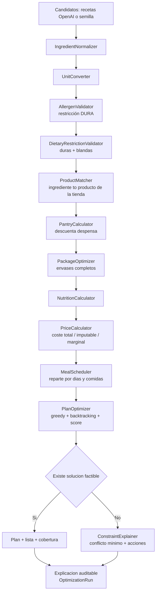

# OPTIMIZATION — Motor determinista y optimización

> **Principio rector**: *OpenAI propone; el núcleo determinista valida y calcula.*
> Todo lo que afecte a **seguridad** (alergias), **dinero** (precios, coste, envases) y
> **cumplimiento de restricciones** se decide aquí, de forma **reproducible y auditable**,
> y funciona **sin OpenAI**. El dinero es SIEMPRE `Decimal` (Python) / `numeric` (Postgres);
> **nunca `float`**.

Este documento describe el motor determinista de CestaPlan: sus componentes, el cálculo de
**envases completos**, la **función de puntuación** configurable, el algoritmo de búsqueda
(greedy + backtracking limitado + semilla reproducible + búsqueda discreta de envases), las
métricas de **cobertura de precios**, el comportamiento **cuando no hay solución** y la
**interfaz futura para OR-Tools**.

---

## 1. Visión general del pipeline

El motor recibe un conjunto de **candidatos** (recetas propuestas por OpenAI o recetas
semilla), los **requisitos de comidas** (`MealRequirement`), el **perfil del hogar**
(alergias, restricciones dietéticas, equipamiento, despensa) y el **catálogo de precios**
de una tienda concreta. Produce un **plan optimizado** (`MealPlan` + `PlannedMeal`) con su
**lista de compra** (`GroceryList`), su **coste**, su **cobertura de precios** y una
**explicación auditable** (`OptimizationRun` + `OptimizationCandidate` +
`OptimizationConstraint`).



El pipeline es **secuencial en las validaciones duras** (un candidato que falla una
restricción dura se descarta antes de gastar cómputo en coste o nutrición) y **combinatorio
en la selección** (`PlanOptimizer` explora combinaciones de candidatos ya validados).

---

## 2. Componentes del motor

Cada componente tiene una **responsabilidad única**, entradas/salidas tipadas (Pydantic v2)
e **invariantes** que se mantienen aunque OpenAI no esté disponible.

### 2.1 `IngredientNormalizer`

| Aspecto | Detalle |
|---|---|
| **Responsabilidad** | Convertir el texto libre de un ingrediente (`display_name`) y su `canonical_name` propuesto en un `Ingredient` canónico del catálogo interno, resolviendo alias (`IngredientAlias`). |
| **Entrada** | `RecipeIngredient` candidato (`canonical_name`, `display_name`, `quantity`, `unit`, `optional`, `substitution_group`). |
| **Salida** | `NormalizedIngredient` con `ingredient_id` resuelto, `quantity: Decimal`, `unit` canónica y flag `matched` / `unresolved`. |
| **Invariantes** | No inventa ingredientes: si no hay match ni alias, marca `unresolved` (no adivina). La cantidad se conserva exacta como `Decimal`. La normalización de texto propuesta por OpenAI **siempre** se re-valida aquí. |

### 2.2 `UnitConverter`

| Aspecto | Detalle |
|---|---|
| **Responsabilidad** | Convertir entre unidades (g↔kg, ml↔l, ud, cucharada→ml, etc.) usando `IngredientConversion` (densidades/equivalencias por ingrediente cuando aplica). |
| **Entrada** | `(quantity: Decimal, from_unit, to_unit, ingredient_id?)`. |
| **Salida** | `quantity: Decimal` en la unidad destino, o error explícito si la conversión no está definida. |
| **Invariantes** | Aritmética en `Decimal`. No hay conversiones "por defecto" silenciosas entre masa y volumen: requiere densidad de `IngredientConversion`; si falta, devuelve error, no una aproximación. Es una **decisión determinista**, nunca de OpenAI. |

### 2.3 `AllergenValidator`

| Aspecto | Detalle |
|---|---|
| **Responsabilidad** | Restricción **DURA** de seguridad. Rechaza cualquier candidato/producto cuyos alérgenos declarados intersecten con las `Allergy` del hogar. |
| **Entrada** | Candidato normalizado + productos mapeados (`ProductNutrition`/alérgenos declarados, p. ej. de Open Food Facts) + lista de `Allergy`. |
| **Salida** | `valid: bool` + lista de `OptimizationConstraint` violadas (con producto/ingrediente causante). |
| **Invariantes** | **OpenAI NO decide seguridad de alergias.** Ante datos de alérgenos ausentes/dudosos, se comporta de forma conservadora (no asume "seguro"). Se apoya en el disclaimer de comprobar etiquetas. Una violación aquí es **no relajable**. |

### 2.4 `DietaryRestrictionValidator`

| Aspecto | Detalle |
|---|---|
| **Responsabilidad** | Aplica `DietaryRestriction` (vegano, vegetariano, halal, sin gluten por elección, etc.). Distingue restricciones **duras** (descarte) de **blandas** (penalización, relajables). |
| **Entrada** | Candidato normalizado + `DietaryProfile` + `DietaryRestriction[]`. |
| **Salida** | `valid: bool`, `soft_violations: list[OptimizationConstraint]` con severidad/peso. |
| **Invariantes** | Las duras descartan; las blandas se traducen en penalización de score (§4). Toda violación queda registrada para el `ConstraintExplainer`. |

### 2.5 `PantryCalculator`

| Aspecto | Detalle |
|---|---|
| **Responsabilidad** | Descuenta de las cantidades necesarias lo que ya hay en la despensa (`PantryItem`), calculando la **cantidad pendiente** a comprar. |
| **Entrada** | `necesaria: Decimal` por ingrediente + `PantryItem[]` (con caducidad). |
| **Salida** | `{ necesaria, disponible_despensa, pendiente }` por ingrediente (todo `Decimal`). |
| **Invariantes** | No usa despensa caducada. `pendiente = max(0, necesaria − disponible_despensa)`. La despensa **reduce coste** pero no altera la cantidad utilizada por la receta. |

### 2.6 `ProductMatcher`

| Aspecto | Detalle |
|---|---|
| **Responsabilidad** | Mapea cada `Ingredient` al/los `Product` + `ProductVariant` **disponibles en la tienda seleccionada** (vía `IngredientProductMapping`), con sus envases (`package_quantity`, `package_unit`). |
| **Entrada** | `ingredient_id`, `store_id`, restricciones (alérgenos ya validados), preferencias. |
| **Salida** | Lista ordenada de candidatos de producto con precio (`ProductPrice`), envase y `source_type`. |
| **Invariantes** | Sólo productos de **esa** tienda y catálogo permitido (no mezcla tiendas sin avisar). Si no hay producto con precio válido, la línea queda **sin precio** (afecta a cobertura, §6), no se inventa. |

### 2.7 `PackageOptimizer`

| Aspecto | Detalle |
|---|---|
| **Responsabilidad** | Núcleo del **cálculo de envases completos**: dada la cantidad pendiente y los envases disponibles, elige el **número entero de envases** a comprar (§3). |
| **Entrada** | `pendiente: Decimal`, catálogo de envases del producto (`package_quantity`, `package_unit`, `amount`). |
| **Salida** | `{ envases: int, comprada: Decimal, utilizada: Decimal, sobrante: Decimal }`. |
| **Invariantes** | Nunca compra fracciones de envase. `comprada = envases × package_quantity ≥ pendiente`. `sobrante = comprada − utilizada`. Búsqueda **discreta** (§5.4) cuando hay varios formatos de envase. |

### 2.8 `NutritionCalculator`

| Aspecto | Detalle |
|---|---|
| **Responsabilidad** | Calcula nutrientes (kcal, macros) del plato y del plan a partir de `ProductNutrition` y las cantidades **utilizadas**. |
| **Entrada** | Ingredientes utilizados (`Decimal`) + `ProductNutrition`. |
| **Salida** | Nutrición por ración y por plan + `desviación` frente a objetivos del `DietaryProfile`. |
| **Invariantes** | **OpenAI NO fija calorías/macros definitivos.** Se calcula sobre datos declarados; si faltan, marca la línea como nutrición incompleta (no inventa). |

### 2.9 `PriceCalculator`

| Aspecto | Detalle |
|---|---|
| **Responsabilidad** | Calcula **coste total**, **coste imputable a la receta** y **coste marginal** (§3.4). |
| **Entrada** | Salida del `PackageOptimizer` + `ProductPrice` (con `observed_at`/`expires_at`/`source_type`). |
| **Salida** | Los tres costes en `Decimal`, más flags de validez del precio. |
| **Invariantes** | `Decimal` de principio a fin. No usa precios caducados como actuales. No confunde precio/kg con precio del envase. No sustituye precio ausente por 0. |

### 2.10 `MealScheduler`

| Aspecto | Detalle |
|---|---|
| **Responsabilidad** | Asigna platos a días y comidas respetando `MealRequirement` (`requested_count`, `selected_dates`, `auto_distribute`, `preferred_days`, `maximum_preparation_minutes`, `requires_tupper`, `reheating_available`). |
| **Entrada** | Candidatos validados + `MealRequirement[]`. |
| **Salida** | `PlannedMeal[]` (asignación día×comida×receta×raciones). |
| **Invariantes** | Respeta huecos: el usuario **no** está obligado a llenar todas las comidas. Soporta cocinar-para-varios-días (`leftover_reuse`), tuppers, repetición e intercambio. No excede `maximum_preparation_minutes`. |

### 2.11 `PlanOptimizer`

| Aspecto | Detalle |
|---|---|
| **Responsabilidad** | Elige la **mejor combinación** de candidatos que satisface las restricciones duras y maximiza la función de puntuación (§4), dentro del presupuesto. |
| **Entrada** | Candidatos validados con coste/nutrición + pesos configurables + semilla. |
| **Salida** | Combinación ganadora (`OptimizationCandidate` marcado) + score desglosado. |
| **Invariantes** | Determinista dada la **semilla**. Greedy + backtracking limitado + búsqueda discreta de envases (§5). No devuelve soluciones que violen restricciones duras ni superen el presupuesto. |

### 2.12 `ConstraintExplainer`

| Aspecto | Detalle |
|---|---|
| **Responsabilidad** | Cuando **no hay solución**, produce el **conjunto mínimo de restricciones conflictivas**, el **presupuesto mínimo** hallado, los **productos que causan el exceso**, las **restricciones blandas relajables** y las **acciones** ofrecidas (§7). También explica por qué ganó la combinación elegida. |
| **Entrada** | Traza de `OptimizationConstraint` y candidatos evaluados. |
| **Salida** | Estructura de explicación auditable persistida en `OptimizationRun`. |
| **Invariantes** | Nunca devuelve una **falsa solución**. La explicación es reproducible con la misma semilla y entradas. |

---

## 3. Cálculo de envases completos (CLAVE)

CestaPlan compra **envases completos**. **Nunca** se calcula `cantidad_necesaria / tamaño_envase × precio`
(eso daría un coste fraccionario irreal). Se compran unidades enteras de envase y se rastrea
lo que sobra.

### 3.1 Ejemplo canónico

> Una receta necesita **600 g de pollo**. La tienda vende **bandejas de 500 g** a **4,20 €**
> la bandeja. La despensa tiene **0 g**.

Cálculo:

- Cantidad **necesaria** = 600 g
- Disponible en **despensa** = 0 g
- **Pendiente** = 600 g
- Envases = ⌈600 / 500⌉ = **2 bandejas**
- **Comprada** = 2 × 500 = **1000 g**
- **Utilizada** = 600 g
- **Sobrante** = 1000 − 600 = **400 g**
- **Coste total** = 2 × 4,20 € = **8,40 €**
- **Coste imputable a la receta** = 8,40 € (el producto sólo se usa aquí)
- **Coste marginal** = 8,40 € (no había compra previa de este producto)

Tabla de rastreo (todos los importes `Decimal`):

| Concepto | Valor |
|---|---|
| Cantidad necesaria | 600 g |
| Disponible en despensa | 0 g |
| Pendiente | 600 g |
| Tamaño de envase | 500 g |
| Envases seleccionados | 2 |
| Cantidad comprada | 1000 g |
| Cantidad utilizada | 600 g |
| Cantidad sobrante | 400 g |
| Precio por envase | 4,20 € |
| **Coste total** | **8,40 €** |
| **Coste imputable a la receta** | **8,40 €** |
| **Coste marginal** | **8,40 €** |

> **Contraejemplo prohibido**: `600/500 × 4,20 € = 5,04 €`. Esto es **incorrecto** porque no
> se pueden comprar 1,2 bandejas. El coste real de aprovisionamiento es **8,40 €**.

### 3.2 Fórmulas

```text
pendiente         = max(0, necesaria − disponible_despensa)
envases           = ceil(pendiente / package_quantity)          # entero, ≥ 0
comprada          = envases × package_quantity
utilizada         = min(necesaria, comprada)                     # = necesaria si hay stock
sobrante          = comprada − utilizada
coste_total       = envases × precio_envase                      # Decimal
```

Toda la aritmética usa `Decimal` (redondeo monetario `ROUND_HALF_UP` a 2 decimales sólo en
la **presentación** de importes; los cálculos intermedios conservan precisión). `ceil` opera
sobre `Decimal`, no sobre `float`.

Pseudocódigo (firma, no implementación):

```python
def compute_packages(
    necesaria: Decimal,
    disponible_despensa: Decimal,
    package_quantity: Decimal,
    precio_envase: Decimal,
) -> PackageResult:
    pendiente = max(Decimal(0), necesaria - disponible_despensa)
    envases   = math_ceil(pendiente / package_quantity)   # Decimal-safe ceil → int
    comprada  = Decimal(envases) * package_quantity
    utilizada = min(necesaria, comprada)
    sobrante  = comprada - utilizada
    coste     = Decimal(envases) * precio_envase
    return PackageResult(pendiente, envases, comprada, utilizada, sobrante, coste)
```

### 3.3 Reutilización de ingredientes y sobrantes

El **sobrante** de un producto (p. ej. las 400 g de pollo) queda disponible para **otros
platos del mismo plan**. El `PlanOptimizer` intenta reutilizar sobrantes antes de comprar
más envases (esto reduce desperdicio y coste; ver bonificación de reutilización en §4). Un
producto ya comprado para otra receta produce **coste marginal 0** en las recetas siguientes
mientras haya sobrante suficiente.

### 3.4 Coste total vs. imputable vs. marginal

| Coste | Definición |
|---|---|
| **Coste total** | Lo que cuesta aprovisionar el/los envase(s) completo(s): `envases × precio_envase`. |
| **Coste imputable a la receta** | Parte del coste total atribuida a esta receta según la cantidad **utilizada** por ella respecto al total consumido del producto en el plan. Si el producto sólo se usa aquí, imputable = total. |
| **Coste marginal** | Coste **adicional** de incluir esta receta dado lo ya comprado para otras recetas. Si un sobrante previo cubre la necesidad, el marginal es **0**; si obliga a comprar un envase más, el marginal es el coste de ese envase adicional. |

Estos tres valores se persisten por `PlannedMeal`/`GroceryListItem` para que el plan sea
auditable y para que el usuario entienda por qué un plato "barato" puede tener coste marginal
alto (obligó a abrir un envase nuevo) o coste marginal cero (aprovechó un sobrante).

---

## 4. Función de puntuación configurable

El `PlanOptimizer` evalúa cada combinación factible con una función de puntuación
**ponderada** cuyos pesos son **configurables** (por hogar / por ejecución). Menor score es
mejor: la función suma **penalizaciones** y resta **bonificaciones**.

### 4.1 Fórmula

```text
score(plan) =
      w_waste       · penalizacion_desperdicio(plan)
    + w_repeat      · penalizacion_repeticion(plan)
    + w_cost        · penalizacion_coste(plan)
    + w_time        · penalizacion_tiempo(plan)
    + w_nutrition   · penalizacion_desviacion_nutricional(plan)
    + w_soft        · penalizacion_restricciones_blandas(plan)
    − w_pantry      · bonificacion_uso_despensa(plan)
    − w_favorite    · bonificacion_favoritos(plan)
    + PENALIZACION_RECHAZADO · num_platos_rechazados(plan)
```

Donde `PENALIZACION_RECHAZADO` es una constante **muy grande** (penalización fuerte): incluir
un plato marcado como **rechazado** (`RecipeFeedback` negativo) hace el score prácticamente
inviable, de modo que el optimizador sólo recurre a rechazados si no existe absolutamente
ninguna otra opción factible.

### 4.2 Términos

| Término | Signo | Qué mide |
|---|---|---|
| `penalizacion_desperdicio` | + | Suma de **sobrantes** valorados (coste del sobrante). Penaliza abrir envases que se aprovechan poco. |
| `penalizacion_repeticion` | + | Repetición excesiva de recetas/ingredientes principales a lo largo de la semana. |
| `penalizacion_coste` | + | Coste total del plan (empuja hacia el presupuesto o por debajo). |
| `penalizacion_tiempo` | + | Tiempo total/medio de preparación+cocción; penaliza superar `maximum_preparation_minutes`. |
| `penalizacion_desviacion_nutricional` | + | Distancia entre nutrición del plan y objetivos del `DietaryProfile`. |
| `penalizacion_restricciones_blandas` | + | `DietaryRestriction` blandas incumplidas (§2.4), ponderadas por severidad. |
| `bonificacion_uso_despensa` | − | Premia planes que consumen `PantryItem` (menos compra, menos caducidad). |
| `bonificacion_favoritos` | − | Premia recetas marcadas como favoritas (`FavoriteRecipe`). |
| `PENALIZACION_RECHAZADO` | + (fuerte) | Penalización dura por cada plato rechazado incluido. |

### 4.3 Pesos configurables (valores por defecto orientativos)

| Peso | Por defecto | Efecto de subirlo |
|---|---|---|
| `w_waste` | 1.0 | Prioriza no desperdiciar (menos sobrantes). |
| `w_repeat` | 0.6 | Más variedad. |
| `w_cost` | 1.5 | Planes más baratos. |
| `w_time` | 0.8 | Recetas más rápidas. |
| `w_nutrition` | 1.2 | Ajuste más fino a objetivos nutricionales. |
| `w_soft` | 1.0 | Respeta más las restricciones blandas. |
| `w_pantry` | 1.0 | Aprovecha más la despensa. |
| `w_favorite` | 0.7 | Favorece platos preferidos. |
| `PENALIZACION_RECHAZADO` | 1e9 | (constante dura, no se suele tocar). |

Los pesos se persisten en la `OptimizationRun` para que el resultado sea **reproducible** y
el `ConstraintExplainer` pueda justificar por qué ganó una combinación.

---

## 5. Algoritmo de búsqueda

### 5.1 Filtrado de restricciones duras (poda previa)

Antes de cualquier combinatoria, se **descartan** los candidatos que violan alergias (§2.3)
o restricciones dietéticas duras (§2.4). Esto reduce drásticamente el espacio de búsqueda y
garantiza que ninguna solución candidata sea insegura.

### 5.2 Greedy

Se construye una solución inicial **voraz**: para cada `MealRequirement`, se elige el mejor
candidato disponible según la función de score marginal (considerando reutilización de
sobrantes ya "comprados" por elecciones anteriores). Es rápida y suele estar cerca del óptimo.

### 5.3 Backtracking limitado

Sobre la solución greedy se aplica **backtracking acotado**: se revisan las decisiones que más
contribuyen al score (peores platos, mayor desperdicio, mayor coste marginal) y se prueban
alternativas, con un **límite** de nodos/profundidad/tiempo para garantizar terminación
acotada. Se conserva la mejor solución factible encontrada. El límite es configurable.

### 5.4 Búsqueda discreta de envases

Cuando un producto tiene **varios formatos de envase** (p. ej. pollo en bandeja de 500 g o de
1 kg), la elección de formato es una **búsqueda discreta**: para la cantidad pendiente (y
considerando reutilización entre platos) se evalúan las combinaciones enteras de envases y se
elige la que minimiza `w_waste·sobrante_valorado + w_cost·coste`. No se mezclan fracciones;
todas las opciones son enteras.

### 5.5 Semilla reproducible

Toda desambiguación no determinista (orden de exploración, desempates de score idénticos)
usa un **PRNG sembrado** con una `seed` almacenada en la `OptimizationRun`. Con las **mismas
entradas y la misma semilla**, el motor produce **exactamente el mismo plan** — requisito de
auditabilidad. La semilla se registra y se puede reejecutar.

---

## 6. Cobertura de precios

Un plan puede tener líneas sin precio válido (producto sin `ProductPrice` en la tienda, o
precio caducado). La **cobertura** cuantifica cuánto del plan tiene precio fiable.

### 6.1 Fórmulas

```text
price_coverage           = líneas_con_precio_válido / líneas_totales

weighted_price_coverage  = valor_conocido_estimado / valor_total_aproximado
```

- `price_coverage` es una proporción **simple** de líneas.
- `weighted_price_coverage` pondera por **valor económico** (una línea cara sin precio pesa más
  que una barata). El "valor total aproximado" usa la mejor estimación disponible para las
  líneas sin precio (marcada como estimada, nunca como real).

### 6.2 Los 6 estados de cobertura

| Estado | Condición (orientativa) | Presentación |
|---|---|---|
| **Completo** | `price_coverage == 1.0` y sin datos caducados | Coste **exacto**. |
| **Cobertura alta** | `weighted_price_coverage ≥ 0.9` | Coste fiable; pocas líneas estimadas. |
| **Cobertura parcial** | `0.6 ≤ weighted_price_coverage < 0.9` | Coste conocido + coste estimado; mostrar **rango**. |
| **Cobertura insuficiente** | `weighted_price_coverage < 0.6` | No presentar total como fiable; predomina lo estimado. |
| **Datos caducados** | Existen precios usados fuera de `expires_at` | Avisar: precios no actuales; ofrecer refrescar. |
| **Sin datos** | `price_coverage == 0` | No hay precios; sólo estructura del plan, sin coste real. |

### 6.3 Reglas de presentación

- Nunca etiquetar el total como **exacto** si hay líneas sin precio o caducadas.
- Separar **"coste conocido"** de **"coste estimado"**; mostrar **rango** cuando proceda.
- Ofrecer **reemplazar producto** o **introducir precio manual** para elevar la cobertura.
- No presentar estimaciones como reales; no mezclar tiendas sin avisar; no usar datos
  caducados como actuales.

---

## 7. Cuando no hay solución

El motor **nunca devuelve una falsa solución**. Si no existe combinación factible dentro de
las restricciones duras y el presupuesto, el `ConstraintExplainer` produce un diagnóstico
accionable.

### 7.1 Qué se devuelve

1. **Conjunto mínimo de restricciones conflictivas** (minimal conflict set): el subconjunto
   más pequeño de restricciones que, juntas, hacen imposible el plan (p. ej. "sin gluten" +
   "presupuesto 15 €" + "alta proteína" + "tienda X").
2. **Presupuesto mínimo encontrado**: el coste de la solución factible **más barata** hallada
   ignorando sólo la restricción de presupuesto (cuánto haría falta gastar).
3. **Productos que provocan el exceso**: las líneas/productos que más empujan por encima del
   presupuesto (con su coste), para que el usuario sepa dónde recortar.
4. **Restricciones blandas relajables**: qué restricciones **blandas** podrían relajarse y el
   impacto estimado de hacerlo (las **duras** —alergias— nunca se ofrecen como relajables).

### 7.2 Acciones ofrecidas al usuario

- **Subir el presupuesto** (se muestra el mínimo necesario).
- **Reducir comidas** (bajar `requested_count` o dejar huecos).
- **Cambiar de tienda** (otra tienda puede tener mejores precios/formatos).
- **Aceptar estimados** (permitir líneas con precio estimado para completar el plan, con
  cobertura marcada como parcial/insuficiente).

Todo el diagnóstico se persiste en la `OptimizationRun` (estado `failed` cuando aplica) con
sus `OptimizationConstraint`, de forma reproducible con la misma semilla.

---

## 8. Interfaz futura: OR-Tools (preparada, NO implementada)

El motor MVP usa greedy + backtracking limitado + búsqueda discreta (§5). Se deja **preparada**
una interfaz para un solver de programación con restricciones/entera (**OR-Tools CP-SAT**),
**sin introducirlo aún**.

### 8.1 Diseño de la interfaz

```python
class PlanSolver(Protocol):
    def solve(
        self,
        candidates: list[ValidatedCandidate],
        requirements: list[MealRequirement],
        weights: ScoreWeights,
        budget: Decimal,
        seed: int,
    ) -> PlanSolution | NoSolution: ...
```

- Implementación MVP: `GreedyBacktrackSolver` (§5).
- Implementación futura: `OrToolsCpSatSolver` que modela envases enteros, asignación
  día×comida y presupuesto como restricciones lineales/enteras, con la misma función de score
  como objetivo. **Misma firma, misma salida auditable.**

### 8.2 Criterios para introducir OR-Tools

- El backtracking limitado deja de encontrar soluciones de calidad suficiente al crecer el
  número de comidas, productos o formatos de envase (explosión combinatoria).
- Se necesita **optimalidad demostrable** o **cotas** (gap) que el heurístico no ofrece.
- El tiempo de resolución del heurístico supera el presupuesto de latencia del worker.
- La modelización de restricciones (envases enteros, reutilización, presupuesto) se vuelve
  difícil de mantener como reglas ad-hoc.

Mientras estos criterios no se cumplan, el heurístico determinista es suficiente y más simple
de auditar. La conmutación se hará por configuración, sin cambiar los contratos del motor.

---

## 9. Reproducibilidad y auditoría (resumen)

- **Determinismo**: mismas entradas + misma semilla ⇒ mismo plan.
- **Persistencia**: `OptimizationRun` (semilla, pesos, estado), `OptimizationCandidate`
  (candidatos evaluados y ganador), `OptimizationConstraint` (violaciones/relajaciones).
- **Trazabilidad de dinero**: por línea se guarda necesaria/despensa/pendiente/envases/
  comprada/utilizada/sobrante/coste total/imputable/marginal, todo en `Decimal`.
- **Independencia de OpenAI**: todo §2–§8 funciona con recetas semilla si la IA está
  desactivada (`AI_BILLING_MODE=disabled`).
