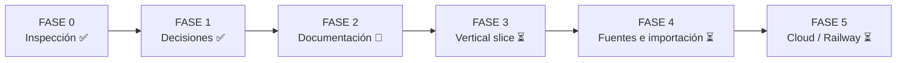
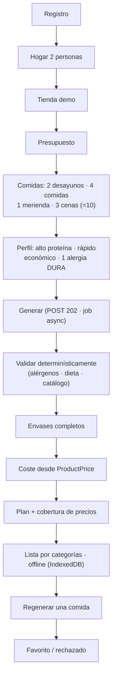

# CestaPlan — ROADMAP

> Plan por fases del MVP. Consistente con el fichero canónico de decisiones, `docs/PRD.md` y `docs/ARCHITECTURE.md`.
> Prosa en español; identificadores y claves en inglés.

---

## 1. Resumen de fases

| Fase | Nombre | Estado |
|---|---|---|
| **FASE 0** | Inspección del terreno | ✅ Hecha |
| **FASE 1** | Preguntas y decisiones | ✅ Hecha |
| **FASE 2** | Documentación | 🔄 En curso (este trabajo) |
| **FASE 3** | Vertical slice | ⏳ Pendiente |
| **FASE 4** | Fuentes de datos e importación | ⏳ Pendiente |
| **FASE 5** | Cloud / Railway | ⏳ Pendiente |

Decisiones del propietario que enmarcan el roadmap: **recetas semilla primero**; el usuario aporta su
`OPENAI_API_KEY` (**BYOK**); **completar FASE 2 y parar**; `git init` local **sin remoto**; **no `git push`**.

---

## 2. FASE 0 — Inspección del terreno ✅

- **Objetivos**: entender el problema, el dominio (planificación con presupuesto), las restricciones legales
  (scraping, licencias de datos) y el estado del arte.
- **Entregables**: comprensión del dominio; identificación de riesgos (precios, alergias, privacidad).
- **Criterios de salida**: alcance y riesgos claros para poder decidir.

## 3. FASE 1 — Preguntas y decisiones ✅

- **Objetivos**: cerrar decisiones de stack, alcance, principios no negociables y modos de despliegue.
- **Entregables**: fichero canónico de decisiones; estructura de monorepo creada; `.env.example`; `LICENSE` (MIT);
  esqueletos de `apps/`, `packages/`, `data/`, `infra/`.
- **Criterios de salida**: decisiones firmes y consistentes para poder documentar y construir.

## 4. FASE 2 — Documentación 🔄 (en curso)

- **Objetivos**: producir documentación de ingeniería completa y auto-consistente que sirva de contrato para
  construir el vertical slice.
- **Entregables**: `docs/` completo — `PRD.md`, `ARCHITECTURE.md`, `ROADMAP.md` (este bloque de trabajo), más
  `DATA_MODEL.md`, `DATA_SOURCES.md`, `OPTIMIZATION.md`, `OPENAI.md`, `SECURITY.md`, `PRIVACY.md`, `DEPLOYMENT.md`,
  `CONTRIBUTING.md`, `ADAPTER_GUIDE.md` y ADRs en `docs/adr/`.
- **Criterios de salida**: los 25 criterios de aceptación están enunciados y trazados; el vertical slice de FASE 3
  está definido sin ambigüedad; toda restricción estricta está documentada. **Al terminar FASE 2, parar.**

## 5. FASE 3 — Vertical slice ⏳

- **Objetivos**: implementar un recorrido **end-to-end** delgado que atraviese todas las capas (auth → hogar →
  tienda → presupuesto → comidas → generación async → validación determinista → envases → coste → plan → lista
  offline → regenerar → favorito), demostrando la arquitectura completa sobre datos **demo**.
- **Entregables**: `web`, `api` y `worker` mínimos funcionando; motor determinista con los componentes necesarios
  para el slice; subconjunto del modelo de datos migrado con Alembic; datos demo cargados; recetas semilla.
- **Criterios de salida**: el vertical slice de §5.1 se ejecuta completo; los criterios de aceptación cubiertos por
  el slice quedan en verde (ver tabla §9).

### 5.1 Definición exacta del vertical slice (canónico)

> **Registro → hogar de 2 personas → tienda demo → presupuesto → 2 desayunos / 4 comidas / 1 merienda / 3 cenas
> (= 10 comidas) → alto en proteína + rápido + económico + 1 alergia dura → generar (job async) → validar
> determinísticamente → envases completos → coste desde `ProductPrice` → plan + cobertura → lista por categorías
> con offline (IndexedDB) → regenerar una comida → favorito/rechazado.**

Subconjunto del modelo de datos usado por el slice:

`User`, `UserSession`, `Household`, `HouseholdMember`, `DietaryProfile`, `Allergy`, `FoodPreference`, `Equipment`,
`Retailer`, `Store`, `Product`, `ProductPrice`, `ProductNutrition`, `DataSource`, `Ingredient`,
`IngredientProductMapping`, `Recipe`, `RecipeIngredient`, `RecipeStep`, `PantryItem`, `MealPlan`, `MealRequirement`,
`PlannedMeal`, `GroceryList`, `GroceryListItem`, `OptimizationRun`, `GenerationJob`, `AuditLog`.

## 6. FASE 4 — Fuentes de datos e importación ⏳

- **Objetivos**: dar de alta datos reales aportados por el usuario/admin sin scraping.
- **Entregables**: adaptadores activos completos (`CsvRetailerAdapter`, `JsonRetailerAdapter`, `ManualRetailerAdapter`,
  `OpenFoodFactsAdapter` para datos **no-precio**), flujo de `DataImport` con `import_id`, `verification_status` y
  `confidence_score`; documentación de `DATA_SOURCES.md` y `ADAPTER_GUIDE.md` operativa.
- **Criterios de salida**: un administrador puede importar un catálogo por CSV/JSON con procedencia completa; OFF se
  integra respetando **ODbL**; los estados de **cobertura de precios** reflejan datos reales.

## 7. FASE 5 — Cloud / Railway ⏳

- **Objetivos**: despliegue gestionado multi-entorno con facturación IA `platform` (sin cobro) y cuotas.
- **Entregables**: servicios `web`, `api`, `worker`, `postgres` en Railway (staging + production); pre-deploy
  `alembic upgrade head`; health checks; `UsageLedger` con cuotas en modo `cloud`; CI en GitHub Actions.
- **Criterios de salida**: despliegue reproducible en ambos entornos; la clave OpenAI gestionada por el servidor no
  se revela; el consumo se registra y se aplican cuotas; **sin pagos**.

---

## 8. Preparado pero no activado

| Elemento | Estado | Cuándo se activaría |
|---|---|---|
| **OR-Tools** | Interfaz preparada en `PlanOptimizer`, no introducida | Cuando el greedy+backtracking no baste para la escala/objetivos |
| **SSE** | Endpoint de stream preparado, no obligatorio | Mejora de UX sobre el polling con backoff; no cambia el contrato de `POST /generate` |
| **Redis** | No usado | Solo si la cola en Postgres deja de escalar; hoy `SELECT FOR UPDATE SKIP LOCKED` es suficiente |
| **Pagos / suscripciones** | Fuera de alcance | Post-MVP; `UsageLedger` ya modela el consumo |
| **Adaptadores de cadenas** | Esqueletos (Aldi, Lidl, Carrefour, Dia, Alcampo, Deza) | FASE 4+ con datos y licencias adecuados |
| **`MercadonaCommunityAdapter`** | Experimental, **desactivado por defecto** | Nunca activado en producción sin revisión legal; conectores comunitarios opt-in |
| **OCR de tickets** (`user_receipt`) | `source_type` reservado | Post-MVP |

---

## 9. Deuda técnica conocida

- **Optimización greedy + backtracking limitado**: puede no encontrar el óptimo global en escenarios ajustados;
  aceptable en el MVP porque nunca devuelve una solución falsa (explica el conflicto). Migrable a OR-Tools sin
  romper la firma de `PlanOptimizer`.
- **Emparejamiento de productos (`ProductMatcher`)** basado en normalización + alias; casos ambiguos requerirán
  intervención manual o mejor heurística.
- **Cola en Postgres**: correcta y simple, pero con muchos workers concurrentes el `SKIP LOCKED` puede necesitar
  ajuste de índices/polling. Documentar métricas antes de considerar Redis.
- **Cobertura de datos demo**: 150 productos / 50 recetas son suficientes para el slice pero no para escenarios
  reales amplios; ampliar en FASE 4 con datos reales importados.
- **Recuperación de contraseña**: preparada, no necesariamente pulida (envío de email real depende del entorno).
- **Contratos generados**: el pipeline Pydantic → JSON Schema → TS/Zod debe ejecutarse en CI para no divergir;
  mientras sea manual es una fuente de deriva.
- **SSE ausente**: el polling con backoff es correcto pero menos reactivo; deuda de UX asumida.

---

## 10. Tabla de estado de los 25 criterios de aceptación

Trazabilidad de los criterios de `docs/PRD.md` §7. Estado por fase donde se espera cubrir cada uno.

| ID | Criterio (resumen) | Fase objetivo | Estado |
|---|---|---|---|
| AC-01 | Registro email+contraseña con Argon2id | FASE 3 | ⏳ Pendiente |
| AC-02 | Sesión opaca en BD, cookie HttpOnly/Secure/SameSite | FASE 3 | ⏳ Pendiente |
| AC-03 | Hogar + miembros con roles owner/editor/viewer | FASE 3 | ⏳ Pendiente |
| AC-04 | Alergias como restricción DURA en el plan final | FASE 3 | ⏳ Pendiente |
| AC-05 | Restricciones dietéticas y preferencias aplicadas | FASE 3 | ⏳ Pendiente |
| AC-06 | Selección de tienda concreta (cadena/CP/tienda/fecha) | FASE 3 | ⏳ Pendiente |
| AC-07 | Presupuesto + nº comensales condicionan el plan | FASE 3 | ⏳ Pendiente |
| AC-08 | Comidas requeridas flexibles (huecos, tuppers, raciones) | FASE 3 | ⏳ Pendiente |
| AC-09 | Generación async: POST 202 + optimization_run_id + status_url | FASE 3 | ⏳ Pendiente |
| AC-10 | Estados del job observables por polling | FASE 3 | ⏳ Pendiente |
| AC-11 | Coste por envases completos (nunca 600/500×precio) | FASE 3 | ⏳ Pendiente |
| AC-12 | ProductPrice con fuente+tienda+fecha; nunca inventar ni 0 | FASE 3/4 | ⏳ Pendiente |
| AC-13 | Cobertura de precios con estado explícito | FASE 3/4 | ⏳ Pendiente |
| AC-14 | Coste conocido vs estimado; reemplazar/precio manual | FASE 3/4 | ⏳ Pendiente |
| AC-15 | Dinero Decimal/numeric/string; ningún float | FASE 3 | ⏳ Pendiente |
| AC-16 | Motor reproducible con semilla | FASE 3 | ⏳ Pendiente |
| AC-17 | Toda función crítica funciona sin OpenAI | FASE 3 | ⏳ Pendiente |
| AC-18 | Flujo OpenAI de 12 pasos; IA no decide lo crítico | FASE 3 | ⏳ Pendiente |
| AC-19 | Contexto a OpenAI pseudonimizado | FASE 3 | ⏳ Pendiente |
| AC-20 | Lista por categorías offline (IndexedDB) | FASE 3 | ⏳ Pendiente |
| AC-21 | Regenerar una única comida | FASE 3 | ⏳ Pendiente |
| AC-22 | Favorito/rechazado influye en la puntuación | FASE 3 | ⏳ Pendiente |
| AC-23 | Sin solución: conflicto mínimo, no plan falso | FASE 3 | ⏳ Pendiente |
| AC-24 | Exportar/eliminar cuenta, desactivar IA, consentimiento | FASE 3/5 | ⏳ Pendiente |
| AC-25 | Disclaimer sanitario obligatorio visible | FASE 3 | ⏳ Pendiente |

> Leyenda: ✅ Completo · 🔄 En curso · ⏳ Pendiente. Actualizar esta tabla a medida que avance FASE 3.
